**Nombre**

- Sebastian Oña

# Clase01: 30 Abril del 2024

## Visual Studio Code

Visual Studio Code es un software de Microsoft que edita códigos fuente disponibles para Windows, Linux y macOS. Este programa no necesita tanto espacio para su instalación a diferencia de Visual Studio. Es compatible con JavaScript y Node.js y extensiones a otros lenguajes como Python.
 **Caracteriisticas**

- **IntelliSense:** esta característica le ofrece al programador el autocompletado y resaltado de sintaxis, lo que lo hace más rápido a la hora de escribir un código. Proporciona sugerencias de códigos y terminaciones inteligentes con relaciones a variables y funciones.
- **Depuración:** esta herramienta ayuda a detectar errores en los códigos, para evitar revisar línea por línea, así como también detecta errores mínimos antes de ejecutar la depuración en sí.
- **Extensiones:** VS Code es un editor potente por las extensiones que maneja, las cuales permiten personalizar y agregar funciones adicionales de forma aislada y modular. Esto hace que sea más fácil programar en diferentes lenguajes, agregar nuevos temas al editor y conectar con otros servicios.

## Comandos visual code

- **Windows**: ==CTRL+SHIFT+P== :  Abre el panel de control que tiene VSC.
- **Windows**: ==CTRL+P== : Abre panel para cambiar de diferente archivo que tengas en tu carpeta.
- **Windows**: ==CTRL+B== : La pestaña que te muestra tus archivos.
- **Windows**: ==CTRL+D== : Te permite cambiar el nombre de varias palabras/variables del mismo nombre.
- **Windows**: ==CTRL+F== : Te ayuda a buscar palbara/variable en el codigo.
- **windows**: ==CTRL+S== : Es la opcion para guardar.
- **Windows**: ==AlT + or -== : Si esta abierto pestañas te permite cambiar a otra.
- **Windows**: ==AlT + up or down== :  Mueve toda la linea de acuerdo a la flecha.

- **windows**: ==SHIFT+ALT+ up or down== : Copia toda la linea a la siguiente.
- **windows**: ==SHIFT+ALT+A== : Pone para comentar una linea.
- **windows**: ==CTRL+K+C== : Pondra toda la linea como comentario.
- **windows**: ==CTRL+T== : Permite mostrar todos los simbolos.
- **windows**: ==CTRL+SPACE== : Te ayuda autocompletar una palabra.
- **windows**: ==CTRL+x== :Borra una linea.
- **windows**: ==ClICK en el archivo + F2== : Cambia el normbre del archivo.

## Personalizacion de nuestro entorno de trabajo

Visual estudio nos permite configurar nuestra inferzas o entorno de trabja a nuestro gusto mediante una gran variedad de extensiones o opcion que posee el mismo visul studio code para esto veremos algunas extenciones que se pueden untilizar para esta personalizacion.

- **Extension para colocar icnonos a cada uno de nuestros archivos**


  - Aqui podemos ver como quedaria una carpeta con archivos e imagenes con iconos diferente para ser identificados de forma facil

        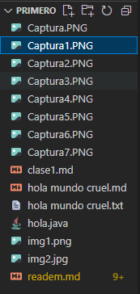

## Uso del terminal y tambien del "Bash"

El terminal o consola es el entorno donde trabjamos directamente con lineas de comando


Este es el terminal por defecto que nos otorga visula studio code el cual pertecene a windows, es decir aqui podremos solo ejecutar comando que pertenezcan a este sistema operativo el cual lleva por nombre power shell

### Git Bash

Es una aplicación para entornos de Microsoft Windows que ofrece una capa de emulación para una experiencia de líneas de comandos de Git.

- **¿Qué es Blash?**
Bash es el acrónimo en inglés de Bourne Again Shell.

- **¿Qué es Shell?**
Es una aplicación de terminal que se utiliza como interfaz con un sistema operativo mediante comandos escritos.

## Comandos de la terminal

- <ins>pwd</ins> : Me permite saber en que directorio estoy trabajando.
- <ins>touch</ins> : Para crear un archivo.
*Ej: touch readme.md*
- <ins>code</ins> : Para crear archivos.
*Ej: code readme.md*
- <ins>touch **""** >> texto2.txt</ins> : Dentro de las comillas escribo lo que quiero que se escriba al crear el archivo -->
*EJ: touch "hola mundo" >> texto2.txt*

## Git y Github

<div style="overflow: hidden; display: flex; align-items: center;">
    <div style="float: left; width: 50%;">
        
    </div>
    <div style="float: right; width: 300%;">
     Git es un sistema de control de versiones rastrea los cambios que se han hecho en un conjunto de archivos es decir, un proyecto.
     <div style="float: right; width: 100%;">
     Github es un servicio que almacena repositorios en sus servidores y control de versiones usando git.
    </div>
    </div>
</div>
### Recomendaciones de otros comandos que tiene markdown

- Si queremos enumerar hacemos lo siguiente:
    1. Linea 1  
    2. Linea 2
        1. Linea 1
        2. linea 2
    3. Linea 3
- Si queremos poner otro signo para ideas hacemos lo siguiente:
  - Linea 1  
  - Linea 2
    - Linea 1
    - linea 2
  - Linea 3

# Clase03: 31 Abril del 2024

### Markdown

<p align="center">
  
</p>
Es un formato que nos permite generar archivos xtml y html utilizando una sintáxis bastante clara y sencilla y sobre todo fácil de escribir.

- markdown (para convertir a pdf mi markdown):
    1. Windows: CTRL+SHIFT+P
    2. Despues busco la opcion de "markdown export pdf"
    3. Se crea automaticamente un archivo pdf de tu markdown

- Para poner cursiva se debe encerrar entre asteriscos:

    \*palabra o texto* = *palabra o texto*  <!-- entre los asteriscos la palbra o el texto estara en cursiva -->
- Para poner en negrillas se debe encerrar entre doble asteriscos:

    \*\*palabra o texto** = **palabra o texto** <!-- entre los dos signos nos permite poner el todo un texto o una palabra en negrita -->
- Para poner cursiva y negrillas se debe encerrar entre triple asteriscos:

    \*\*\*palabra o texto*** = ***palabra o texto*** <!-- cursiva y en negrita -->
- Windows: ALT+9+6 (`) or windows: ALT+1+2+6 (~) <!-- crear este signo para lo siguiente -->
  - Nos permite poner una parte del codigo para analizar despues de (```) tenemos que poner el lenguaje de progrmacion.
    Ejemplos:
            1. 

                ``` java
                public int sumar(){
                int i=10;
                }
                ```
            2. 

                 ``` java
                public clas Hola{
                /* clase principal */
                    public class void main{
                        System.out.println();   
                    }
                }
                ```
- Para hacer cuadros:
  - Se organiza el texto en columnas y filas. Las filas se obtienen con salto de linea de texto y las columnas se obtienen encerrando el texto entre barras: |Texto|
  - Al finalizar la primera fila en donde tenemos los encabezados, se digita una siguiente fila de lineas entrecortadas para dar formato de titulo dentro de la tabla: |----|

        |Columna 1 | columna 2 |
        |----------|-----------|
        |     A    |      B    |
        |     C    |      D    |

    Para lo cual obtendremos:

    |Columna 1 | columna 2|
    |---------|----------|
    |    A    |     B    |
    |    C    |     D    |
- Insertar link o enlace:

  - Si queremos solo insertar el hipervinculo al URL debemos encerrar entre <> la direccion.

        <https://www.google.com>
     De lo que obtenemos: <https://www.google.com>

  - Si queremos aplicar un hipervinculo a un texto con un direccion, el texto se encierra entre corchetes, el enlace entre parentesis y si deseamos aplicar un mensaje sobre el texto cuando se pose el cursor, se encierra dicho mensaje entre comillas.

        [Buscador](https://www.google.com "Google")
    De lo que obtenemos: [Buscador](https://www.google.com "Google")

- Comandos de git
    1. <ins>git init</ins> : Crea un carpeta oculta en tu carpeta de proyecto  y va aparecer tus archivo con "U".
    2. <ins>git status</ins> : Te muestra que archivos has guardado --> (rojo: no esta guardado and verde: esta guardado).
    3. <ins>git commit</ins> : Para guradar el proyecto.
    4. <ins>git checkout -b "Nombre de rama"</ins> : Crea y cambia de rama.
    5. <ins>git branch</ins> : Crea una rama.
    6. <ins>git push</ins> : Subo todo al github.
    7. <ins>git pull</ins> : Nos ayuda a traer los cambios hechos en la nube.
    8. <ins>git clone url</ins> : Baja el archivo de algun proyecto.
    9. <ins>git ignore</ins> : Dentro del archivo puedes poner archivos q va ignorar o no va a guardar.
    10. <ins>git config --global user.name "nombre"</ins> : Colocar nombre de ususario.
    11. <ins>git config user.name</ins> : Verificar si esta su nombre de ususario. (**Es lo mismo para el email solo cambia user.email**)
    12. <ins>git config --global init.default branch "main"</ins> : Cambiar de master a main.
    13. <ins>git commit -m Descripcion</ins> :Agregar cambios al repositorio local y una descripcion del cambio.
    14. <ins>git log</ins> :Muestra historial de commits. Si agregas "--oneline", aparece mas compacto.
    15. <ins>git add .</ins> : Agregar cambios al commit.
    16. <ins>git config --global core.editor</ins> : Asociar al vscode.
    17. <ins>git branch -m nombre actual nombre nuevo</ins> : Cambiar nombre de rama sin estar en la rama a la que se va a cambiar.
    18. <ins>git branch -d</ins> : Eliminar rama (locales no publicadas).
    19. <ins>git merge nombre-de-rama</ins> : Fusionar rama con main.
    20. <ins>git remote</ins> : Ver nombre del repositorio remoto.
    21. <ins>git fetch origin</ins> : Crear una rama local con los cambios de la rama remota.
    22. <ins>git push origin -d</ins> : Eliminar rama remota.

# Resumenes de las siguientes clases 

### P.O.O


## Ambitos
- public: Indica que los miembros (variables o métodos) son accesibles desde cualquier clase o paquete.
Son visibles para todos.
- protected: Los miembros con esta visibilidad son accesibles dentro del mismo paquete o por subclases,
incluso si están en paquetes diferentes.
- private: Limita el acceso a los miembros solo dentro de la misma clase. No son visibles ni accesibles
desde ninguna otra clase.

## UML

Los diagramas UML (Lenguaje Unificado de Modelado) son una herramienta fundamental en la programación orientada a objetos, especialmente en Java. Permiten visualizar la estructura y el diseño de un sistema de software antes de codificarlo, lo que ayuda a planificar y comunicar ideas de manera clara entre los desarrolladores. UML apoya la abstracción y el diseño de clases, relaciones, patrones de diseño y otros aspectos de POO, facilitando así la comprensión y el desarrollo del software

## 3) Codigo
    ``` java
    public class Mujer(){
        private float Mujer edad;
        public boolean tieneOjos;
        public String tipoCablello;

        protect String bailar( String cancion, int tiempoMin, String ritmo){
            return "Baile fenomenal";
        }
    }

    ```
 ### Resumen porque es importante P.O.O
 - Es importante porque proporciona una estructura clara para los programas que facilita el desarrollo y mantenimiento del código, permite la reutilización de código y hace que el software sea más flexible y fácil de modificar. Además, la POO puede ayudar a manejar sistemas complejos al dividirlos en partes más pequeñas y manejables, conocidas como objetos

    # Tipos de datos Importantes para progrmamar

## Strings
- charAt(index): Obtener un caracter
- length(): Longitud de la cadena
- substring(inicio, fin): Extraer parte de la cadena
- indexOf(cadena): Buscar una cadena en otra
- equalsIgnoreCase(cadena): Comparar cadenas sin distinciones entre mayusculas y minusculas
## Scanner
- Scanner stdIn = new Scanner(System.in)
- nextInt() : Leer enteros
- nextDouble() : Leer double
- nextLine() : Salto de linea

## Declaracion de Arrays 
- int [] arr ; // Sin asignar memoria
- arr=new int[5]; // Asignando memoria al array
- arr[i] : Acceder a los elementos del array
- Operadores Aritmeticos
- +, -, *, / (Solo numeros)
- % (Modulo)
- ++ -- (Operador de incremento / decremento)
- Metodos para trabajar con arrays
- Arrays.toString(array); Imprime el contenido del array como String
- Arrays.sort(array); Ordena el array
- Arrays.binarySearch(array, elementoABuscar); Devuelve la posicion donde se encuentra el elemento o -1 si no
  lo encuentra
## Listas
- List list; Es una lista genérica que puede contener cualquier tipo de dato
- add(Object o): Agrega un elemento a la lista
- remove(Object o): Elimina un elemento de la lista
- contains(Object o): Devuelve true si contiene el objeto y false en caso contrario
- size(): Devuelve la cantidad de elementos en la lista
- isEmpty(): Devuelve true si esta vacia y false en caso contrario
- get(int index): Devuelve el elemento en la posicion indicada por "index"
- set(int index, Object o): Coloca el elemento "o" en la posición "index"
- indexOf(Object o): Devuelve la primera posición donde se encuentra el elemento "o", devuelve -1 si no
 esta presente.
- lastIndexOf(Object o): Igual que anterior pero busca desde el final hacia atrás.


# Getter/Setter

los getters y setters son métodos que se utilizan para obtener y establecer el valor de las variables privadas de una clase, respectivamente. Esto se hace para proporcionar un control más seguro del acceso a las variables
``` java
public class Ejemplo {
    private int numero;

    // Getter
    public int getNumero() {
        return numero;
    }

    // Setter
    public void setNumero(int nuevoNumero) {
        numero = nuevoNumero;
    }
}
```

# Constructores

Los constructores en Java son métodos especiales que se utilizan para inicializar objetos. Cuando se crea un nuevo objeto, el constructor establece los valores iniciales de los atributos del objeto y puede realizar cualquier configuración o inicialización necesaria.

Las ventajas de tener constructores en Java incluyen:

1. Inicialización Controlada: Los constructores proporcionan un lugar centralizado para inicializar los atributos de un objeto, asegurando que el objeto esté en un estado válido desde el momento de su creación.

2. Sobrecarga de Constructores: Java permite la sobrecarga de constructores, lo que significa que puedes tener múltiples constructores con diferentes listas de parámetros, ofreciendo flexibilidad en la inicialización de objetos.

3. Legibilidad del Código: Los constructores hacen que el código sea más legible al proporcionar una clara indicación de cómo se deben crear e inicializar los objetos.

- Ejemplo de codigo:

``` java
    public class Coche {
        private String marca;
        private String modelo;
        private int año;

        // Constructor
        public Coche(String marca, String modelo, int año) {
            this.marca = marca;
            this.modelo = modelo;
            this.año = año;
        }
```
- como podemos ver al crear el contrusctor debemos poner public
seguido del nombre de la clase y toma tres parámetros (marca, modelo y año) y los asigna a las variables de instancia del objeto

# Diagrama de caso de uso

### Componentes 
actor .- actua con el sistema,estimula al sistema con algun evento o recibe informacion de sistema. Es un actor externo al sitema

### relaciones
- extends.- se utiliza para representar una relación opcional o condicional entre dos casos de uso, donde un caso de uso extiende la funcionalidad de otro sin ser obligatorio
- include.- se usa para indicar que un caso de uso contiene la funcionalidad de otro caso de uso, lo que significa que siempre se ejecutará como parte del caso de uso que lo incluye. Ambas relaciones ayudan a simplificar los diagramas y a reutilizar comportamientos comunes entre diferentes casos de uso

# Herencia
La herencia en Java es un principio de la programación orientada a objetos que permite que una clase (llamada subclase o clase derivada) herede atributos y métodos de otra clase (llamada superclase o clase base)


### Importancia 

1. Reutilización de Código: Permite a las subclases utilizar métodos y variables de la superclase, evitando la duplicación de código
2. Organización Lógica: Facilita la creación de una jerarquía de clases que refleja relaciones del mundo real, lo que hace que el código sea más intuitivo y fácil de entender.
3. Polimorfismo: La herencia permite que objetos de diferentes subclases sean tratados como objetos de la superclase, lo que es útil para implementar operaciones generalizadas.

### Extends en Herencia
 La palabra clave extends se utiliza en la declaración de una clase para indicar que esa clase va a heredar de otra clase. La herencia permite que la nueva clase, conocida como subclase, adquiera los atributos y métodos de la clase existente, llamada superclase. Esto facilita la reutilización de código y la creación de jerarquías de clases.
 ``` java
 class Superclase {
    // Atributos y métodos de la superclase
}

class Subclase extends Superclase {
    // La Subclase hereda atributos y métodos de la Superclase
}
```
### @overide
 la anotación @Override se utiliza para indicar que el método de una subclase está sobrescribiendo un método de su superclase. Sirve varios propósitos:

 1. Claridad: Hace explícito para los desarrolladores que el método está destinado a sobrescribir otro, lo que mejora la legibilidad del código.
 2. Seguridad en la Compilación: Si el método sobrescrito no coincide con ningún método en la superclase, el compilador generará un error, previniendo posibles errores en tiempo de ejecución.
3. Mantenimiento del Código: Facilita el mantenimiento del código al asegurar que los cambios en las firmas de los métodos de la superclase se reflejen en las subclases.
``` java
 class Superclase {
    public void mostrarMensaje() {
        System.out.println("Mensaje de la superclase");
    }
}

class Subclase extends Superclase {
    @Override
    public void mostrarMensaje() {
        System.out.println("Mensaje sobrescrito de la subclase");
    }
}
```
- Subclase está sobrescribiendo el método mostrarMensaje() de Superclase. La anotación @Override indica que este es el comportamiento deseado

# Package 

Es una forma de organizar clases relacionadas o interfaces en grupos lógicos, lo que facilita su mantenimiento y organización. Los packages ayudan a evitar conflictos de nombres, ya que dos clases pueden tener el mismo nombre pero en diferentes packages. Además, los packages pueden controlar el acceso con modificadores de acceso como public, private, y protected

ventajas importantes:

1. Organización: Permite clasificar las clases e interfaces por funcionalidad, lo que facilita la búsqueda y el uso de estas.
2. Evitar conflictos de nombres: Como cada package crea un nuevo espacio de nombres, puedes tener clases con el mismo nombre en diferentes packages sin que haya un conflicto.
3. Control de acceso: Los packages permiten restringir el acceso a clases y miembros de clases utilizando modificadores de acceso, lo que mejora la seguridad del código.
4. Reutilización: Los packages facilitan la reutilización de código al permitir que las clases sean fácilmente accesibles desde otros proyectos.
Mantenimiento: Un sistema bien organizado en packages es más fácil de mantener y actualizar.

# Relaciones entre clases

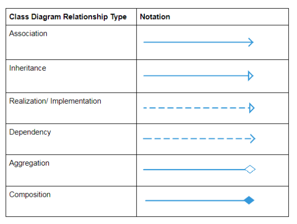

# Realization/ Implementation

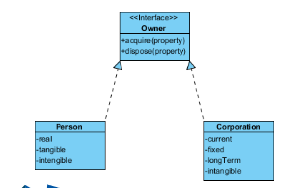

Una interfaz es una referencia de tipo que se utiliza para definir un contrato que las clases pueden implementar. Las interfaces sirven para:

1. Definir Métodos Abstractos: Una interfaz declara métodos sin implementarlos, dejando que las clases que la implementan definan el comportamiento concreto.
2. Separación de Contrato y Implementación: Permiten separar lo que se debe hacer de cómo se debe hacer, proporcionando una capa de abstracción.
3. Polimorfismo: Las interfaces permiten que diferentes clases sean tratadas como del mismo tipo si implementan la misma interfaz, facilitando el polimorfismo.


# 2do Bimestre

## Clase 1 : 18 de Junio del 2024

### Herencia 

### Cardinalidad

 La cardinalidad se refiere a la evaluación cuantitativa de las relaciones entre distintas entidades de datos dentro de un esquema o modelo. Específicamente, denota el número de ocurrencias de una entidad de datos en relación con otra entidad. 

 - En términos más simples, la cardinalidad describe cuántas instancias de una entidad de datos están relacionadas con otra entidad. Puede ser:
    1. Uno a uno ("1..1"): Cada instancia de una entidad se relaciona con exactamente una instancia de otra entidad. 
    2. Uno a muchos("1..n" o "1..*"): Cada instancia de una entidad se relaciona con una o más instancias de otra entidad.
    3. Muchos a uno("n..1"): Varias instancias de una entidad se relacionan con una única instancia de otra entidad.
    4. Muchos a muchos("n..m"): Varias instancias de una entidad se relacionan con varias instancias de otra entidad.
 - Otras terminos:
    - 1 --> sólo uno
    - 0..1 --> cero o uno
    - n --> Indica cuántas relaciones pueden haber.
    - (*) --> cero o más
    - 0..* --> cero o más (lo mismo que el anterior)

 - Aqui una imagen como ejemplo:

 <p align="center">
 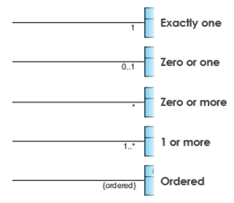
</p>

#### Asociacion (Cardinalidad)
<p align="center">
 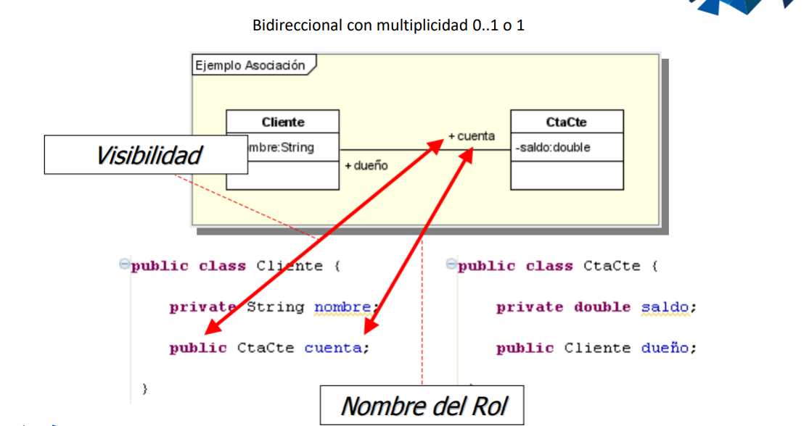
</p>


 - Bidireccional con cardinalidad 0..1 o 1

<p align="center">
 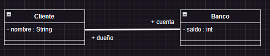
</p>

Como se veria en codigo:

<p align="center">
 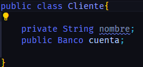 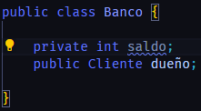
</p>

 - Direccional con multiplicidad 0..1 o 1

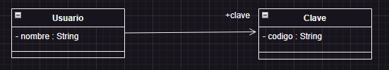

Como se veria en codigo:

<p align="center">
 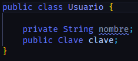 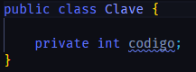
</p>

 - Bidireccional con multiplicidad
 
    - Ejemplos:
        1. UML + Asociación (multiplicidad / cardinalidad : 0,1,+, 0..*)
            <p align="center">
            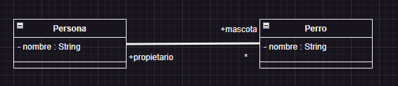  
            </p>
            Como se veria en codigo:
            <p align="center">
            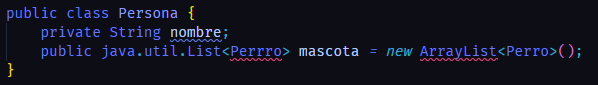 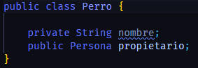
            </p>
        2. UML +Asociación (multiplicidad / cardinalidad : 0,1,+, 0..*)
            <p align="center">
            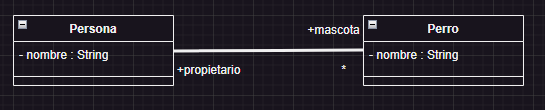 
            </p>
            Como se veria en codigo:
            <p align="center">
            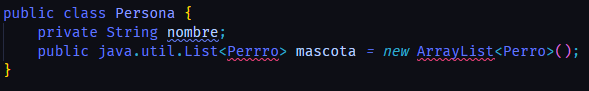 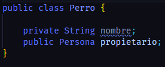
            </p>
        3. UML + Asociación (multiplicidad / cardinalidad : 0,1,+, 0..*)
            <p align="center">
             
            </p>
            Como se veria en codigo:
            <p align="center">
            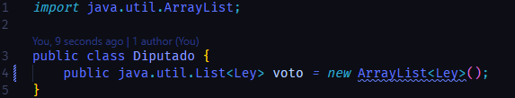 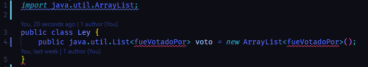
            </p>
 - Relaciones
    
    1. UML + Asociación (multiplicidad / cardinalidad : 0,1,+, 0..*, 1..*)
        
        <p align="center">
        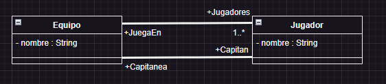 
        </p>
        Como se veria en codigo:
        <p align="center">
        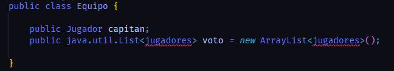 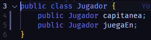
        </p>

## Correcion del taller

En la siguiente imagen podemos apreciar como debio verse el diagrama de clase, del taller realizado la anterior clase
y aumentado lo que vimos en la clase del dia de hoy:

<p align="center">
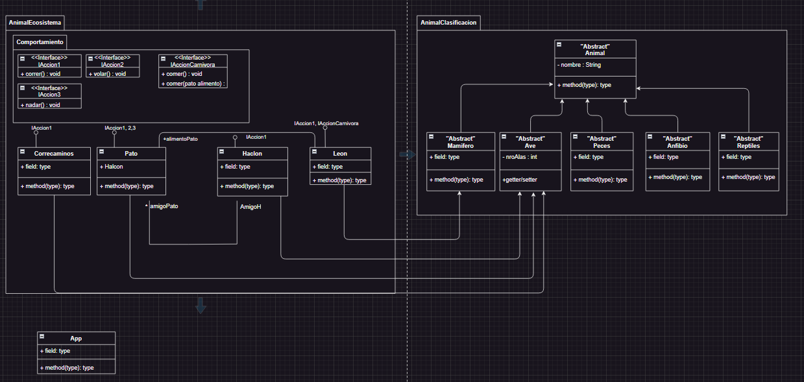 
</p>

Las siguientes imagenes vamos a ver como se veria en el visualcode y en codigo:
        
- Visual Code:

<p align="center">
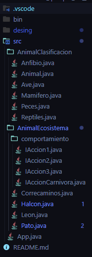 
</p>

- Codigo 

    Una de las cosas importantes mientras realizabamos el diagrama de Clase, es entender en cual resultar conveniente
    poner una variable en esa clase, ya que si muchas hay diferentes clases puedan heredar esa variable y asi ahorrar lineas
    de codigos

<p align="center">
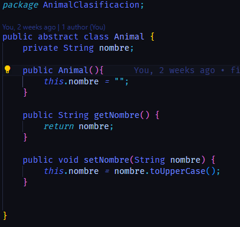 
</p>

    Entonces al momento que las demas clases como mamifero,ave,etc. Heredan esa variable y asi no tienes que crearla en cada
    una de ellas y si leon hereda de mamifero entences leon tambien tendra la propiedad.

- Codigo de las clases que mandamos a llamar en la App principal

<p align="center">
        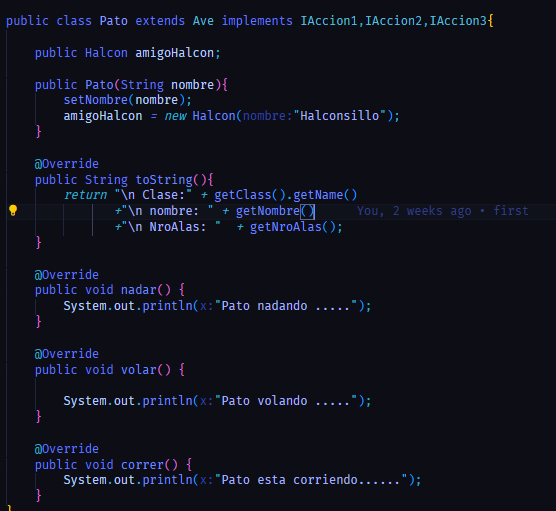 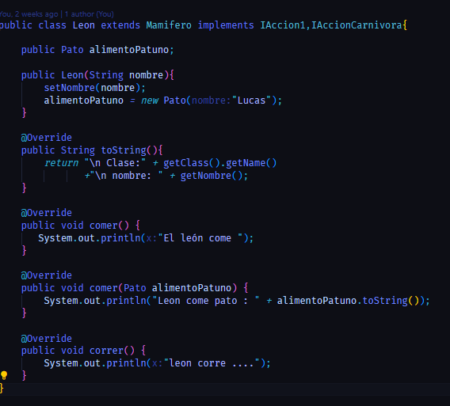
        </p>
- En estas clases aparece algo interesante que es el toString()

El método toString() en Java es una función que devuelve una representación en cadena de texto de un objeto. Sirve para obtener información legible sobre el objeto y facilita su impresión o visualización en pantalla1. Aquí tienes algunos detalles importantes:

¿Qué es el método toString() en Java?

1. El método toString() se utiliza para convertir cualquier objeto Java en una cadena de texto.
2. Todos los objetos heredan este método de la clase Object.
3. Siempre que intentes imprimir o transformar a cadena un objeto, estarás utilizando implícitamente el método toString().

## Clase 2:      

### Repaso para la prueba

## Clase 3: 

### PRUEBA

## Clase 4:
Clase de 30 min

## Clase 5:
CLASE DE 1 HORA

## Clase 6:
Clase de 1 hora

## Clase 7:
Taller Grupal(Aplicando lo aprendido lo visto en las tres ultimas Clases)

## Clase 8:

### Correcion del diagrama de Clase

#### Base de Datos

- Una caracteristica es que base de datos se guarda en el disco duro
(datos estatico)/persistir -> tablas -> reglas 

- P.O.O se guarda en la RAM
(datos dinamicos) -> Clases(objetos)

- Atomico
Significa mientras sea unico 

pongamos un ejemplo:
1. Persona(cedula(1),nombre1(1),nombre2(1),Apellido(1), TipoSangre(1), .....)

esto que quiere decir que cada dato la persona solo tiene un nombre1, un nombre 2 y asi sucesivamente
entonces si pasa que uno de esos tienes mayor a uno entonces te podria dar error


- Reglas:
    1. 1....1
    2. 1....*
    3. n....n

- Resolucion 
1. 1.......1
(P.C)<---->(P.C)

|idP | Cedula | Nombre | Apellido|  |idP|TipSangre|S|
|----|--------|--------|---------|  |---|---------|-|
|  1 |  17547 | Pepe   | Andrade |  |1  |   A+    | |
|  2 |  18734 | Ana    | Soto    |  |2  |   B-    | |
|  3 |  17372 | Maria  | Perez   |  |3  |   A     | |

- Un consejo importante es elegir el (P.C) en este caso seria recomendable usar la columna idP 
porque no es una columna importante ya que al elgir la columna Cedula pouede pasar que ingresas 
mal un numero y no despues va a ser muy dificil modificar ese numero y puede empezar a darte problemas
despues


