**Nombre**

- Sebastian Oña

# Clase01: 30 Abril del 2024

## Visual Studio Code

Visual Studio Code es un software de Microsoft que edita códigos fuente disponibles para Windows, Linux y macOS. Este programa no necesita tanto espacio para su instalación a diferencia de Visual Studio. Es compatible con JavaScript y Node.js y extensiones a otros lenguajes como Python.
 **Caracteriisticas**

- **IntelliSense:** esta característica le ofrece al programador el autocompletado y resaltado de sintaxis, lo que lo hace más rápido a la hora de escribir un código. Proporciona sugerencias de códigos y terminaciones inteligentes con relaciones a variables y funciones.
- **Depuración:** esta herramienta ayuda a detectar errores en los códigos, para evitar revisar línea por línea, así como también detecta errores mínimos antes de ejecutar la depuración en sí.
- **Extensiones:** VS Code es un editor potente por las extensiones que maneja, las cuales permiten personalizar y agregar funciones adicionales de forma aislada y modular. Esto hace que sea más fácil programar en diferentes lenguajes, agregar nuevos temas al editor y conectar con otros servicios.

## Comandos visual code

- **Windows**: ==CTRL+SHIFT+P== :  Abre el panel de control que tiene VSC.
- **Windows**: ==CTRL+P== : Abre panel para cambiar de diferente archivo que tengas en tu carpeta.
- **Windows**: ==CTRL+B== : La pestaña que te muestra tus archivos.
- **Windows**: ==CTRL+D== : Te permite cambiar el nombre de varias palabras/variables del mismo nombre.
- **Windows**: ==CTRL+F== : Te ayuda a buscar palbara/variable en el codigo.
- **windows**: ==CTRL+S== : Es la opcion para guardar.
- **Windows**: ==AlT + or -== : Si esta abierto pestañas te permite cambiar a otra.
- **Windows**: ==AlT + up or down== :  Mueve toda la linea de acuerdo a la flecha.

- **windows**: ==SHIFT+ALT+ up or down== : Copia toda la linea a la siguiente.
- **windows**: ==SHIFT+ALT+A== : Pone para comentar una linea.
- **windows**: ==CTRL+K+C== : Pondra toda la linea como comentario.
- **windows**: ==CTRL+T== : Permite mostrar todos los simbolos.
- **windows**: ==CTRL+SPACE== : Te ayuda autocompletar una palabra.
- **windows**: ==CTRL+x== :Borra una linea.
- **windows**: ==ClICK en el archivo + F2== : Cambia el normbre del archivo.

## Personalizacion de nuestro entorno de trabajo

Visual estudio nos permite configurar nuestra inferzas o entorno de trabja a nuestro gusto mediante una gran variedad de extensiones o opcion que posee el mismo visul studio code para esto veremos algunas extenciones que se pueden untilizar para esta personalizacion.

- **Extension para colocar icnonos a cada uno de nuestros archivos**
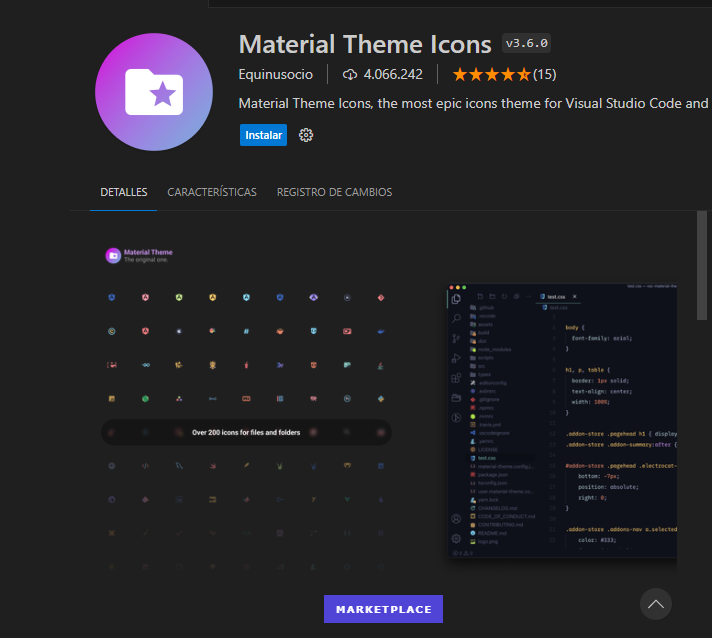

  - Aqui podemos ver como quedaria una carpeta con archivos e imagenes con iconos diferente para ser identificados de forma facil

        

## Uso del terminal y tambien del "Bash"

El terminal o consola es el entorno donde trabjamos directamente con lineas de comando


Este es el terminal por defecto que nos otorga visula studio code el cual pertecene a windows, es decir aqui podremos solo ejecutar comando que pertenezcan a este sistema operativo el cual lleva por nombre power shell

### Git Bash

Es una aplicación para entornos de Microsoft Windows que ofrece una capa de emulación para una experiencia de líneas de comandos de Git.

- **¿Qué es Blash?**
Bash es el acrónimo en inglés de Bourne Again Shell.

- **¿Qué es Shell?**
Es una aplicación de terminal que se utiliza como interfaz con un sistema operativo mediante comandos escritos.

## Comandos de la terminal

- <ins>pwd</ins> : Me permite saber en que directorio estoy trabajando.
- <ins>touch</ins> : Para crear un archivo.
*Ej: touch readme.md*
- <ins>code</ins> : Para crear archivos.
*Ej: code readme.md*
- <ins>touch **""** >> texto2.txt</ins> : Dentro de las comillas escribo lo que quiero que se escriba al crear el archivo -->
*EJ: touch "hola mundo" >> texto2.txt*

## Git y Github

<div style="overflow: hidden; display: flex; align-items: center;">
    <div style="float: left; width: 50%;">
        
    </div>
    <div style="float: right; width: 300%;">
     Git es un sistema de control de versiones rastrea los cambios que se han hecho en un conjunto de archivos es decir, un proyecto.
     <div style="float: right; width: 100%;">
     Github es un servicio que almacena repositorios en sus servidores y control de versiones usando git.
    </div>
    </div>
</div>
### Recomendaciones de otros comandos que tiene markdown

- Si queremos enumerar hacemos lo siguiente:
    1. Linea 1  
    2. Linea 2
        1. Linea 1
        2. linea 2
    3. Linea 3
- Si queremos poner otro signo para ideas hacemos lo siguiente:
  - Linea 1  
  - Linea 2
    - Linea 1
    - linea 2
  - Linea 3

# Clase03: 31 Abril del 2024

### Markdown

<p align="center">
  
</p>
Es un formato que nos permite generar archivos xtml y html utilizando una sintáxis bastante clara y sencilla y sobre todo fácil de escribir.

- markdown (para convertir a pdf mi markdown):
    1. Windows: CTRL+SHIFT+P
    2. Despues busco la opcion de "markdown export pdf"
    3. Se crea automaticamente un archivo pdf de tu markdown

- Para poner cursiva se debe encerrar entre asteriscos:

    \*palabra o texto* = *palabra o texto*  <!-- entre los asteriscos la palbra o el texto estara en cursiva -->
- Para poner en negrillas se debe encerrar entre doble asteriscos:

    \*\*palabra o texto** = **palabra o texto** <!-- entre los dos signos nos permite poner el todo un texto o una palabra en negrita -->
- Para poner cursiva y negrillas se debe encerrar entre triple asteriscos:

    \*\*\*palabra o texto*** = ***palabra o texto*** <!-- cursiva y en negrita -->
- Windows: ALT+9+6 (`) or windows: ALT+1+2+6 (~) <!-- crear este signo para lo siguiente -->
  - Nos permite poner una parte del codigo para analizar despues de (```) tenemos que poner el lenguaje de progrmacion.
    Ejemplos:
            1. 

                ``` java
                public int sumar(){
                int i=10;
                }
                ```
            2. 

                 ``` java
                public clas Hola{
                /* clase principal */
                    public class void main{
                        System.out.println();   
                    }
                }
                ```
- Para hacer cuadros:
  - Se organiza el texto en columnas y filas. Las filas se obtienen con salto de linea de texto y las columnas se obtienen encerrando el texto entre barras: |Texto|
  - Al finalizar la primera fila en donde tenemos los encabezados, se digita una siguiente fila de lineas entrecortadas para dar formato de titulo dentro de la tabla: |----|

        |Columna 1 | columna 2 |
        |----------|-----------|
        |     A    |      B    |
        |     C    |      D    |

    Para lo cual obtendremos:

    |Columna 1 | columna 2|
    |---------|----------|
    |    A    |     B    |
    |    C    |     D    |
- Insertar link o enlace:

  - Si queremos solo insertar el hipervinculo al URL debemos encerrar entre <> la direccion.

        <https://www.google.com>
     De lo que obtenemos: <https://www.google.com>

  - Si queremos aplicar un hipervinculo a un texto con un direccion, el texto se encierra entre corchetes, el enlace entre parentesis y si deseamos aplicar un mensaje sobre el texto cuando se pose el cursor, se encierra dicho mensaje entre comillas.

        [Buscador](https://www.google.com "Google")
    De lo que obtenemos: [Buscador](https://www.google.com "Google")

- Comandos de git
    1. <ins>git init</ins> : Crea un carpeta oculta en tu carpeta de proyecto  y va aparecer tus archivo con "U".
    2. <ins>git status</ins> : Te muestra que archivos has guardado --> (rojo: no esta guardado and verde: esta guardado).
    3. <ins>git commit</ins> : Para guradar el proyecto.
    4. <ins>git checkout -b "Nombre de rama"</ins> : Crea y cambia de rama.
    5. <ins>git branch</ins> : Crea una rama.
    6. <ins>git push</ins> : Subo todo al github.
    7. <ins>git pull</ins> : Nos ayuda a traer los cambios hechos en la nube.
    8. <ins>git clone url</ins> : Baja el archivo de algun proyecto.
    9. <ins>git ignore</ins> : Dentro del archivo puedes poner archivos q va ignorar o no va a guardar.
    10. <ins>git config --global user.name "nombre"</ins> : Colocar nombre de ususario.
    11. <ins>git config user.name</ins> : Verificar si esta su nombre de ususario. (**Es lo mismo para el email solo cambia user.email**)
    12. <ins>git config --global init.default branch "main"</ins> : Cambiar de master a main.
    13. <ins>git commit -m Descripcion</ins> :Agregar cambios al repositorio local y una descripcion del cambio.
    14. <ins>git log</ins> :Muestra historial de commits. Si agregas "--oneline", aparece mas compacto.
    15. <ins>git add .</ins> : Agregar cambios al commit.
    16. <ins>git config --global core.editor</ins> : Asociar al vscode.
    17. <ins>git branch -m nombre actual nombre nuevo</ins> : Cambiar nombre de rama sin estar en la rama a la que se va a cambiar.
    18. <ins>git branch -d</ins> : Eliminar rama (locales no publicadas).
    19. <ins>git merge nombre-de-rama</ins> : Fusionar rama con main.
    20. <ins>git remote</ins> : Ver nombre del repositorio remoto.
    21. <ins>git fetch origin</ins> : Crear una rama local con los cambios de la rama remota.
    22. <ins>git push origin -d</ins> : Eliminar rama remota.

# Resumenes de las siguientes clases 

### P.O.O


## Ambitos
- public: Indica que los miembros (variables o métodos) son accesibles desde cualquier clase o paquete.
Son visibles para todos.
- protected: Los miembros con esta visibilidad son accesibles dentro del mismo paquete o por subclases,
incluso si están en paquetes diferentes.
- private: Limita el acceso a los miembros solo dentro de la misma clase. No son visibles ni accesibles
desde ninguna otra clase.

## UML

Los diagramas UML (Lenguaje Unificado de Modelado) son una herramienta fundamental en la programación orientada a objetos, especialmente en Java. Permiten visualizar la estructura y el diseño de un sistema de software antes de codificarlo, lo que ayuda a planificar y comunicar ideas de manera clara entre los desarrolladores. UML apoya la abstracción y el diseño de clases, relaciones, patrones de diseño y otros aspectos de POO, facilitando así la comprensión y el desarrollo del software

## 3) Codigo
    ``` java
    public class Mujer(){
        private float Mujer edad;
        public boolean tieneOjos;
        public String tipoCablello;

        protect String bailar( String cancion, int tiempoMin, String ritmo){
            return "Baile fenomenal";
        }
    }

    ```
 ### Resumen porque es importante P.O.O
 - Es importante porque proporciona una estructura clara para los programas que facilita el desarrollo y mantenimiento del código, permite la reutilización de código y hace que el software sea más flexible y fácil de modificar. Además, la POO puede ayudar a manejar sistemas complejos al dividirlos en partes más pequeñas y manejables, conocidas como objetos

    # Tipos de datos Importantes para progrmamar

## Strings
- charAt(index): Obtener un caracter
- length(): Longitud de la cadena
- substring(inicio, fin): Extraer parte de la cadena
- indexOf(cadena): Buscar una cadena en otra
- equalsIgnoreCase(cadena): Comparar cadenas sin distinciones entre mayusculas y minusculas
## Scanner
- Scanner stdIn = new Scanner(System.in)
- nextInt() : Leer enteros
- nextDouble() : Leer double
- nextLine() : Salto de linea

## Declaracion de Arrays 
- int [] arr ; // Sin asignar memoria
- arr=new int[5]; // Asignando memoria al array
- arr[i] : Acceder a los elementos del array
- Operadores Aritmeticos
- +, -, *, / (Solo numeros)
- % (Modulo)
- ++ -- (Operador de incremento / decremento)
- Metodos para trabajar con arrays
- Arrays.toString(array); Imprime el contenido del array como String
- Arrays.sort(array); Ordena el array
- Arrays.binarySearch(array, elementoABuscar); Devuelve la posicion donde se encuentra el elemento o -1 si no
  lo encuentra
## Listas
- List list; Es una lista genérica que puede contener cualquier tipo de dato
- add(Object o): Agrega un elemento a la lista
- remove(Object o): Elimina un elemento de la lista
- contains(Object o): Devuelve true si contiene el objeto y false en caso contrario
- size(): Devuelve la cantidad de elementos en la lista
- isEmpty(): Devuelve true si esta vacia y false en caso contrario
- get(int index): Devuelve el elemento en la posicion indicada por "index"
- set(int index, Object o): Coloca el elemento "o" en la posición "index"
- indexOf(Object o): Devuelve la primera posición donde se encuentra el elemento "o", devuelve -1 si no
 esta presente.
- lastIndexOf(Object o): Igual que anterior pero busca desde el final hacia atrás.

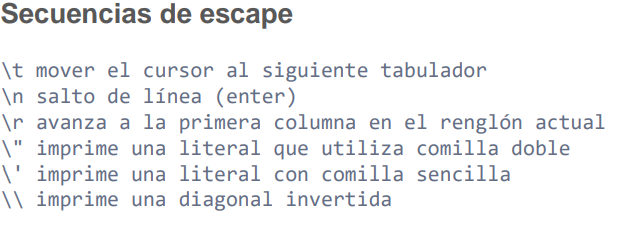

# Getter/Setter

los getters y setters son métodos que se utilizan para obtener y establecer el valor de las variables privadas de una clase, respectivamente. Esto se hace para proporcionar un control más seguro del acceso a las variables
``` java
public class Ejemplo {
    private int numero;

    // Getter
    public int getNumero() {
        return numero;
    }

    // Setter
    public void setNumero(int nuevoNumero) {
        numero = nuevoNumero;
    }
}
```

# Constructores

Los constructores en Java son métodos especiales que se utilizan para inicializar objetos. Cuando se crea un nuevo objeto, el constructor establece los valores iniciales de los atributos del objeto y puede realizar cualquier configuración o inicialización necesaria.

Las ventajas de tener constructores en Java incluyen:

1. Inicialización Controlada: Los constructores proporcionan un lugar centralizado para inicializar los atributos de un objeto, asegurando que el objeto esté en un estado válido desde el momento de su creación.

2. Sobrecarga de Constructores: Java permite la sobrecarga de constructores, lo que significa que puedes tener múltiples constructores con diferentes listas de parámetros, ofreciendo flexibilidad en la inicialización de objetos.

3. Legibilidad del Código: Los constructores hacen que el código sea más legible al proporcionar una clara indicación de cómo se deben crear e inicializar los objetos.

- Ejemplo de codigo:

``` java
    public class Coche {
        private String marca;
        private String modelo;
        private int año;

        // Constructor
        public Coche(String marca, String modelo, int año) {
            this.marca = marca;
            this.modelo = modelo;
            this.año = año;
        }
```
- como podemos ver al crear el contrusctor debemos poner public
seguido del nombre de la clase y toma tres parámetros (marca, modelo y año) y los asigna a las variables de instancia del objeto

# Diagrama de caso de uso
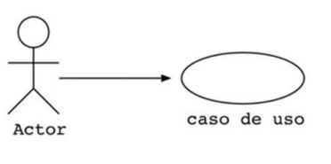
### Componentes 
actor .- actua con el sistema,estimula al sistema con algun evento o recibe informacion de sistema. Es un actor externo al sitema

### relaciones
- extends.- se utiliza para representar una relación opcional o condicional entre dos casos de uso, donde un caso de uso extiende la funcionalidad de otro sin ser obligatorio
- include.- se usa para indicar que un caso de uso contiene la funcionalidad de otro caso de uso, lo que significa que siempre se ejecutará como parte del caso de uso que lo incluye. Ambas relaciones ayudan a simplificar los diagramas y a reutilizar comportamientos comunes entre diferentes casos de uso

# Herencia
La herencia en Java es un principio de la programación orientada a objetos que permite que una clase (llamada subclase o clase derivada) herede atributos y métodos de otra clase (llamada superclase o clase base)


### Importancia 

1. Reutilización de Código: Permite a las subclases utilizar métodos y variables de la superclase, evitando la duplicación de código
2. Organización Lógica: Facilita la creación de una jerarquía de clases que refleja relaciones del mundo real, lo que hace que el código sea más intuitivo y fácil de entender.
3. Polimorfismo: La herencia permite que objetos de diferentes subclases sean tratados como objetos de la superclase, lo que es útil para implementar operaciones generalizadas.

### Extends en Herencia
 La palabra clave extends se utiliza en la declaración de una clase para indicar que esa clase va a heredar de otra clase. La herencia permite que la nueva clase, conocida como subclase, adquiera los atributos y métodos de la clase existente, llamada superclase. Esto facilita la reutilización de código y la creación de jerarquías de clases.
 ``` java
 class Superclase {
    // Atributos y métodos de la superclase
}

class Subclase extends Superclase {
    // La Subclase hereda atributos y métodos de la Superclase
}
```
### @overide
 la anotación @Override se utiliza para indicar que el método de una subclase está sobrescribiendo un método de su superclase. Sirve varios propósitos:

 1. Claridad: Hace explícito para los desarrolladores que el método está destinado a sobrescribir otro, lo que mejora la legibilidad del código.
 2. Seguridad en la Compilación: Si el método sobrescrito no coincide con ningún método en la superclase, el compilador generará un error, previniendo posibles errores en tiempo de ejecución.
3. Mantenimiento del Código: Facilita el mantenimiento del código al asegurar que los cambios en las firmas de los métodos de la superclase se reflejen en las subclases.
``` java
 class Superclase {
    public void mostrarMensaje() {
        System.out.println("Mensaje de la superclase");
    }
}

class Subclase extends Superclase {
    @Override
    public void mostrarMensaje() {
        System.out.println("Mensaje sobrescrito de la subclase");
    }
}
```
- Subclase está sobrescribiendo el método mostrarMensaje() de Superclase. La anotación @Override indica que este es el comportamiento deseado

# Package 

Es una forma de organizar clases relacionadas o interfaces en grupos lógicos, lo que facilita su mantenimiento y organización. Los packages ayudan a evitar conflictos de nombres, ya que dos clases pueden tener el mismo nombre pero en diferentes packages. Además, los packages pueden controlar el acceso con modificadores de acceso como public, private, y protected

ventajas importantes:

1. Organización: Permite clasificar las clases e interfaces por funcionalidad, lo que facilita la búsqueda y el uso de estas.
2. Evitar conflictos de nombres: Como cada package crea un nuevo espacio de nombres, puedes tener clases con el mismo nombre en diferentes packages sin que haya un conflicto.
3. Control de acceso: Los packages permiten restringir el acceso a clases y miembros de clases utilizando modificadores de acceso, lo que mejora la seguridad del código.
4. Reutilización: Los packages facilitan la reutilización de código al permitir que las clases sean fácilmente accesibles desde otros proyectos.
Mantenimiento: Un sistema bien organizado en packages es más fácil de mantener y actualizar.

# Relaciones entre clases

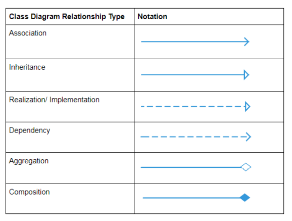

# Realization/ Implementation

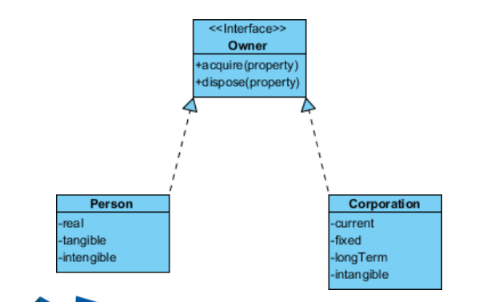

Una interfaz es una referencia de tipo que se utiliza para definir un contrato que las clases pueden implementar. Las interfaces sirven para:

1. Definir Métodos Abstractos: Una interfaz declara métodos sin implementarlos, dejando que las clases que la implementan definan el comportamiento concreto.
2. Separación de Contrato y Implementación: Permiten separar lo que se debe hacer de cómo se debe hacer, proporcionando una capa de abstracción.
3. Polimorfismo: Las interfaces permiten que diferentes clases sean tratadas como del mismo tipo si implementan la misma interfaz, facilitando el polimorfismo.


# 2do Bimestre

## Clase 1 : 18 de Junio del 2024

### Herencia 

### Cardinalidad

 La cardinalidad se refiere a la evaluación cuantitativa de las relaciones entre distintas entidades de datos dentro de un esquema o modelo. Específicamente, denota el número de ocurrencias de una entidad de datos en relación con otra entidad. 

 - En términos más simples, la cardinalidad describe cuántas instancias de una entidad de datos están relacionadas con otra entidad. Puede ser:
    1. Uno a uno ("1..1"): Cada instancia de una entidad se relaciona con exactamente una instancia de otra entidad. 
    2. Uno a muchos("1..n" o "1..*"): Cada instancia de una entidad se relaciona con una o más instancias de otra entidad.
    3. Muchos a uno("n..1"): Varias instancias de una entidad se relacionan con una única instancia de otra entidad.
    4. Muchos a muchos("n..m"): Varias instancias de una entidad se relacionan con varias instancias de otra entidad.
 - Otras terminos:
    - 1 --> sólo uno
    - 0..1 --> cero o uno
    - n --> Indica cuántas relaciones pueden haber.
    - (*) --> cero o más
    - 0..* --> cero o más (lo mismo que el anterior)

 - Aqui una imagen como ejemplo:

 <p align="center">
 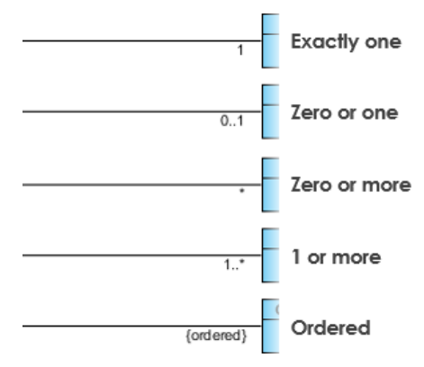
</p>

#### Asociacion (Cardinalidad)
<p align="center">
 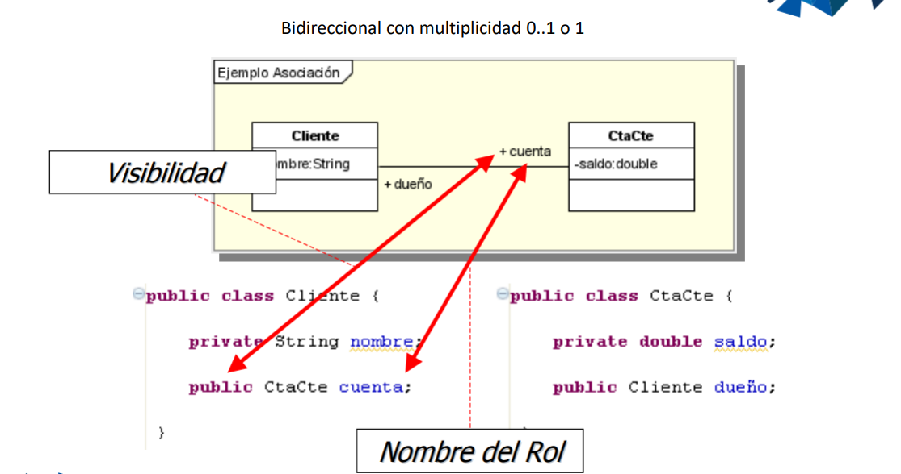
</p>


 - Bidireccional con cardinalidad 0..1 o 1

<p align="center">
 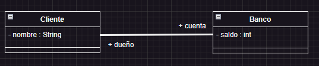
</p>

Como se veria en codigo:

<p align="center">
 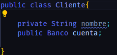 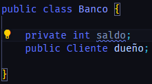
</p>

 - Direccional con multiplicidad 0..1 o 1

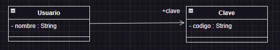

Como se veria en codigo:

<p align="center">
 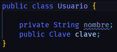 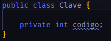
</p>

 - Bidireccional con multiplicidad
 
    - Ejemplos:
        1. UML + Asociación (multiplicidad / cardinalidad : 0,1,+, 0..*)
            <p align="center">
            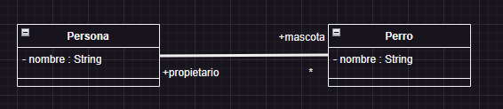  
            </p>
            Como se veria en codigo:
            <p align="center">
            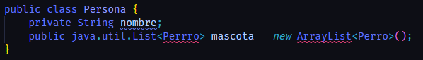 
            </p>
        2. UML +Asociación (multiplicidad / cardinalidad : 0,1,+, 0..*)
            <p align="center">
            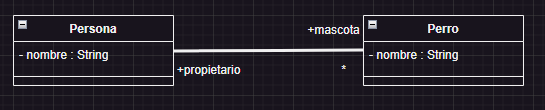 
            </p>
            Como se veria en codigo:
            <p align="center">
            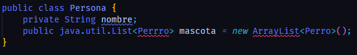 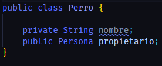
            </p>
        3. UML + Asociación (multiplicidad / cardinalidad : 0,1,+, 0..*)
            <p align="center">
            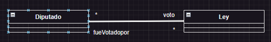 
            </p>
            Como se veria en codigo:
            <p align="center">
            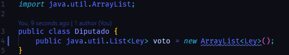 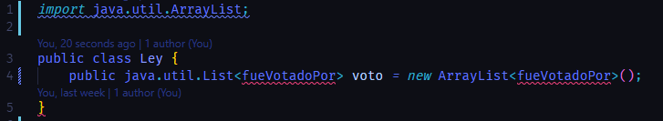
            </p>
 - Relaciones
    
    1. UML + Asociación (multiplicidad / cardinalidad : 0,1,+, 0..*, 1..*)
        
        <p align="center">
        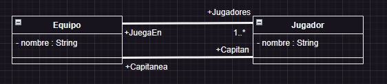 
        </p>
        Como se veria en codigo:
        <p align="center">
        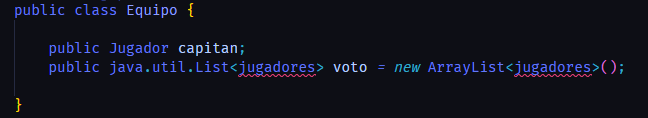 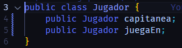
        </p>

## Correcion del taller

En la siguiente imagen podemos apreciar como debio verse el diagrama de clase, del taller realizado la anterior clase
y aumentado lo que vimos en la clase del dia de hoy:

<p align="center">
 
</p>

Las siguientes imagenes vamos a ver como se veria en el visualcode y en codigo:
        
- Visual Code:

<p align="center">
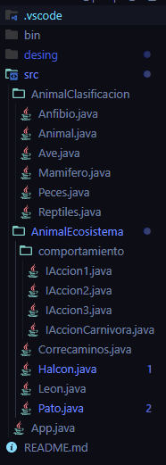 
</p>

- Codigo 

    Una de las cosas importantes mientras realizabamos el diagrama de Clase, es entender en cual resultar conveniente
    poner una variable en esa clase, ya que si muchas hay diferentes clases puedan heredar esa variable y asi ahorrar lineas
    de codigos

<p align="center">
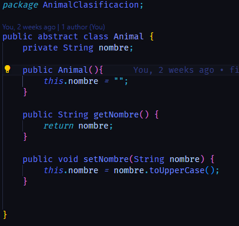 
</p>

    Entonces al momento que las demas clases como mamifero,ave,etc. Heredan esa variable y asi no tienes que crearla en cada
    una de ellas y si leon hereda de mamifero entences leon tambien tendra la propiedad.

- Codigo de las clases que mandamos a llamar en la App principal

<p align="center">
        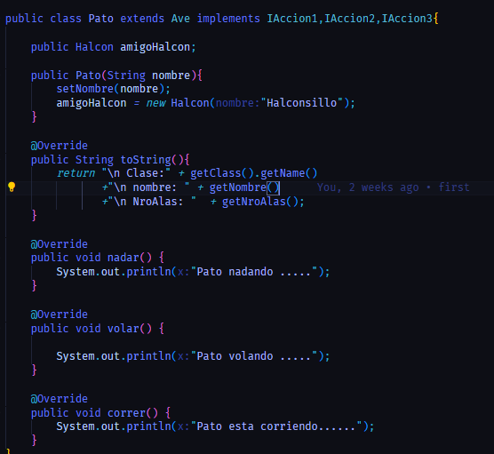 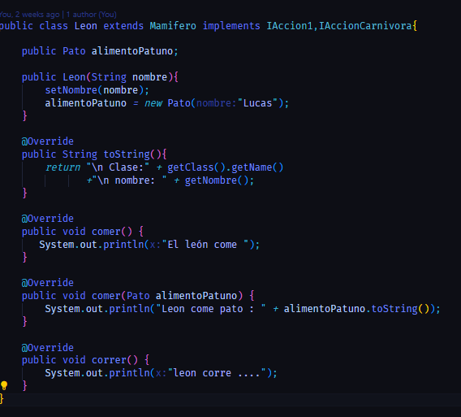
        </p>
- En estas clases aparece algo interesante que es el toString()

El método toString() en Java es una función que devuelve una representación en cadena de texto de un objeto. Sirve para obtener información legible sobre el objeto y facilita su impresión o visualización en pantalla1. Aquí tienes algunos detalles importantes:

¿Qué es el método toString() en Java?

1. El método toString() se utiliza para convertir cualquier objeto Java en una cadena de texto.
2. Todos los objetos heredan este método de la clase Object.
3. Siempre que intentes imprimir o transformar a cadena un objeto, estarás utilizando implícitamente el método toString().

## Clase 2:      

### Repaso para la prueba

## Clase 3: 

### PRUEBA

## Clase 4:
Clase de 30 min

## Clase 5:
CLASE DE 1 HORA

## Clase 6:
Clase de 1 hora

## Clase 7:
Taller Grupal(Aplicando lo aprendido lo visto en las tres ultimas Clases)

## Clase 8:

### Correcion del diagrama de Clase

#### Base de Datos

<p align="center">
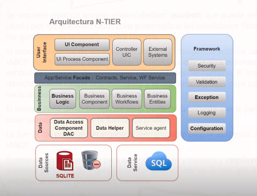
</p>

- Una caracteristica es que base de datos se guarda en el disco duro
(datos estatico)/persistir -> tablas -> reglas 

- P.O.O se guarda en la RAM
(datos dinamicos) -> Clases(objetos)

- Atomico
Significa mientras sea unico 

pongamos un ejemplo:
1. Persona(cedula(1),nombre1(1),nombre2(1),Apellido(1), TipoSangre(1), .....)

esto que quiere decir que cada dato la persona solo tiene un nombre1, un nombre 2 y asi sucesivamente
entonces si pasa que uno de esos tienes mayor a uno entonces te podria dar error


- Reglas:
    1. 1....1
    2. 1....*
    3. n....n

- Resolucion 
1. 1.......1
(P.K)<---->(P.K)

|idP | Cedula | Nombre | Apellido|  |idP|TipSangre|S|
|----|--------|--------|---------|  |---|---------|-|
|  1 |  17547 | Pepe   | Andrade |  |1  |   A+    | |
|  2 |  18734 | Ana    | Soto    |  |2  |   B-    | |
|  3 |  17372 | Maria  | Perez   |  |3  |   A     | |

- Un consejo importante es elegir el (P.k) en este caso seria recomendable usar la columna idP 
porque no es una columna importante ya que al elgir la columna Cedula puede pasar que ingresas 
mal un numero y no despues va a ser muy dificil modificar ese numero y puede empezar a darte problemas en un futuro.

## Clase nro 9

Copiar los diagrmas de mi cuaderno a la compu

## Clase nro 10

Aplicamos lo visto en las anteriores dos clase de Base de Datos:

Primero es instalas la siguiente extencion:

<p align="center">

</p>

Entonces para este ejercicio vamos a crear un nuevo proyecto llamado EXABOT, despues creamos la 
carpeta desing, Script y Datebase

    Script: Esta carpeta es donde vamos a crear con codigo nuestras tablas de base de datos por decirlo 
            de una manera.

    DateBase: Se va a conectar con el archivo de Scrpit para que se vea visualmente nuestra base de datos
    
En la siguiente imagen podemos ver como se debes crear los archivos
<p align="center">
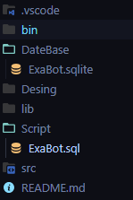
</p>

En esta clase el inge nos pase lo que ya tenia hecho de los Script:

<p align="center">
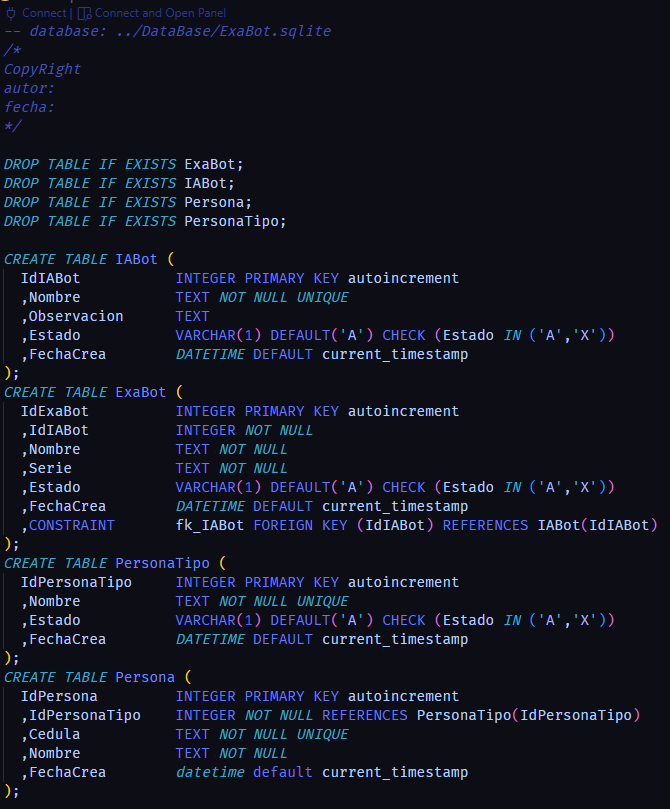
</p>

Punto importante a tener en cuenta es:

- Esta linea de codigo conecta al archivo ExaBot.sqlite para poder ver visualmente nuestras tablas que vamos creando
  en nuestra base de datos:
    <!-- -- database: ../DataBase/ExaBot.sqlite -->

- Asi se iria viendo una vez mandemos a correr:

<p align="center">
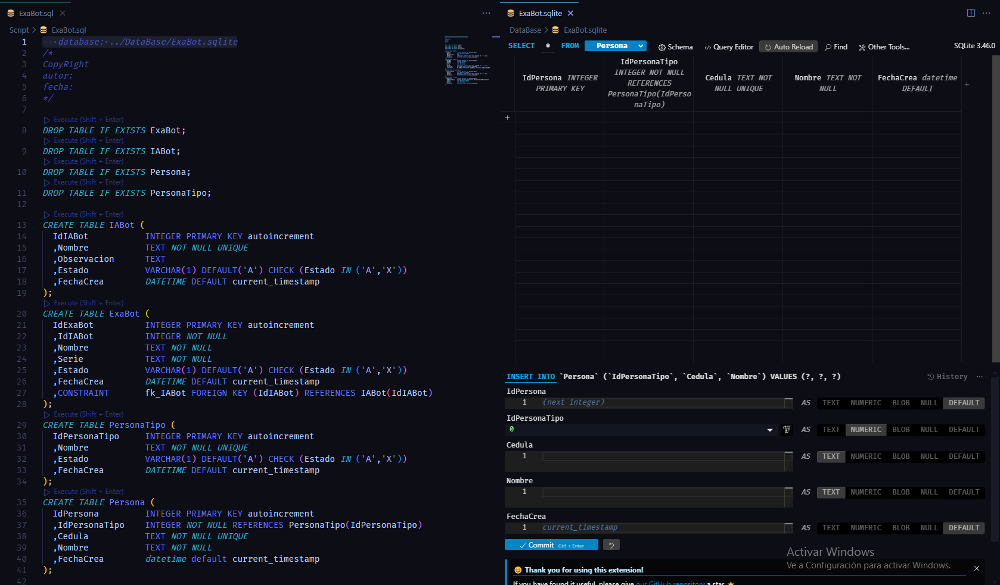
</p>

- La siguiente linea de codigo ayuda a borrar una tabla siempre y cuendo exista, lo que ocurre es que al crear una tabla 
  y puede pasar que te falto agregar algo un dato mas y mandas a correr te sale error, entonces la solucion es borrar la tabla y 
  volver a crearla y eso lo haces con este comando:
  
    <!-- DROP TABLE IF EXISTS ExaBot; -->

 - Vamos a crear otro archivo en la carpeta Script para ingresar datos en la tabla

<p align="center">
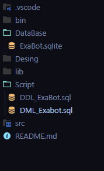
</p>

Partes importantes de codigos que nos ayudara mientras vamos llenando datos en nuetsra tablas:

1. INSERT INTO NOMBRETABLA: Nos va ayudar a ingresar datos en nuestras tablas creadas.
    Ejemplo:
    <p align="center">
    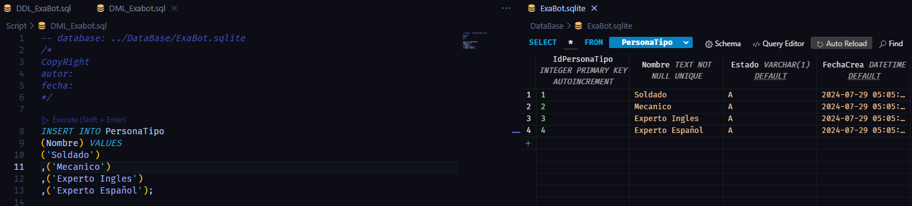
    </p>

2. SELECT * FROM PersonaTipo; -> En lo que nos va a ayudar este codigo es buscar la tabla que queramos y haci facilitarnos ver
                                 que tipo de informacion hay que llenar en una tabla.

    Ejemplo:
    <p align="center">
    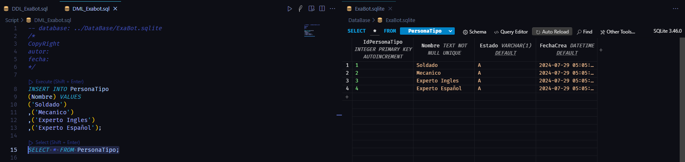
    </p>

3. SELECT count (*) FROM PersonaTipo; -> Este en cuestion nos va a ayudar para saber cuantos datos tenemos en una tabla.
    Ejemplo:
    <p align="center">
    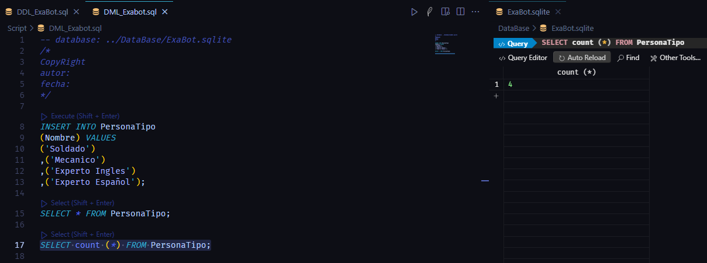
    </p>

4. SELECT * FROM PersonaTipo WHERE IdPersonaTipo=2; -> Este nos ayuda a encontrar datos en la tabla que hemos creado y el 
                                                       =2 puedes cambiarlo con <3 y te mostrara todo los datos menores que ese numero.
    Ejemplo:
    - <p align="center">
      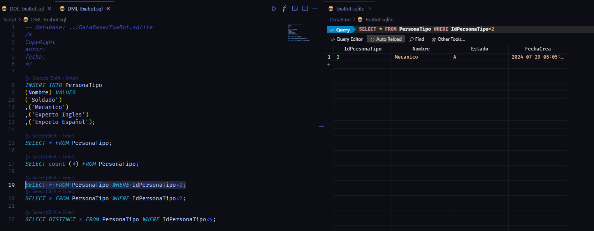
      </p>

    - <p align="center">
      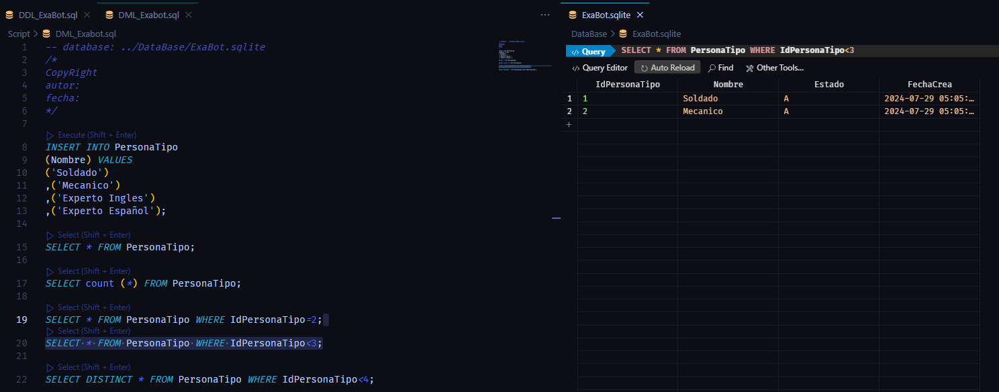
      </p>
5. SELECT Nombre FROM PersonaTipo WHERE Nombre like:

    - "s%" -> si pones despues de like significa que buscara todas las palabras que comiencen con "s".
    Ejemplo:
        <p align="center">
      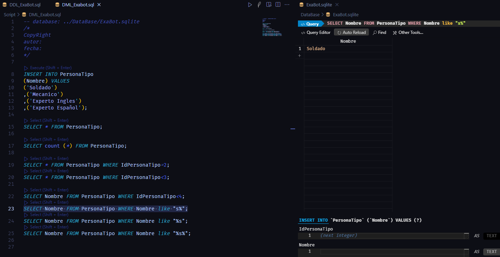
      </p>
    - "%s" -> si pones despues de like significa que buscara todas las palabras que terminen con "s".
    Ejemplo:
        <p align="center">
      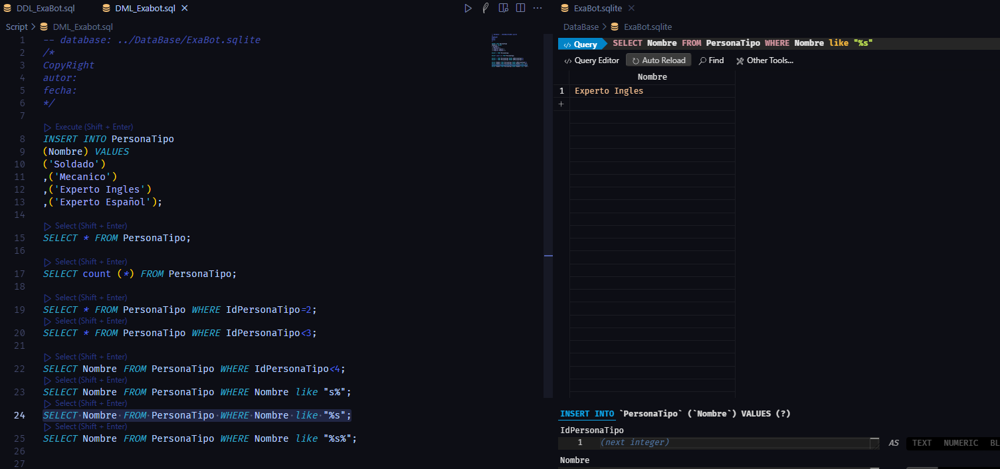
      </p>
    - "%s%" -> si pones despues de like significa que buscara todas las palabras que tengan entre sus palabras la letra "s".
    Ejemplo:
        <p align="center">
      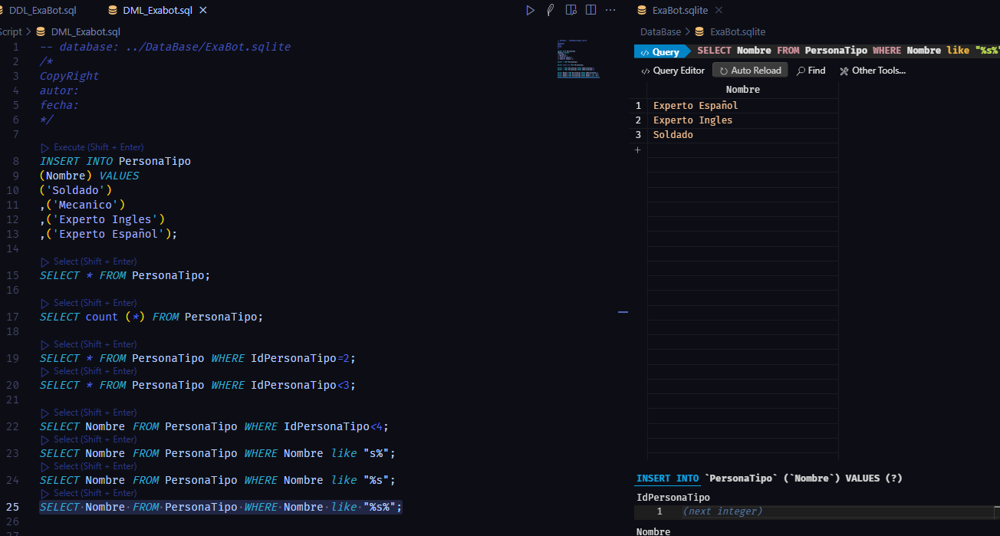
      </p>

6. DELETE FROM Persona; -> Nos ayuda a borrar datos de una tabla, pero en la siguiente imagen nos muestra q al borrar
                           datos quedan espacios vacios y esto despues puede crear errores pero ayuda a ver que datos borraron
                           por eso la importancio de la fechaModificacion y que usuario hizo ese cambio.
    Ejemplo:
    <p align="center">
      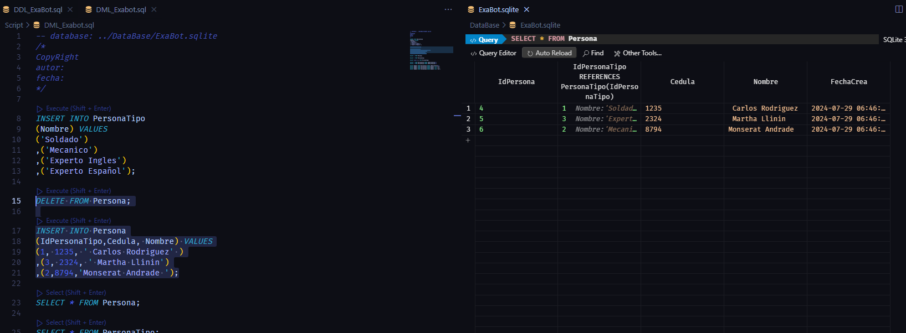
      </p>

7. UPDATE Persona SET Nombre = 'Sebastian Andrade ' WHERE Cedula = '1235';
    - Nos ayuda a modificar un solo dato que ya registre, en la parte de SET eligues que columna quieres cambiar el dato
      y el where lo usas para que sepa que fila es y tenga ese como referencia sino se cambiara toda la columna

    Ejemplo:
<p align="center">
      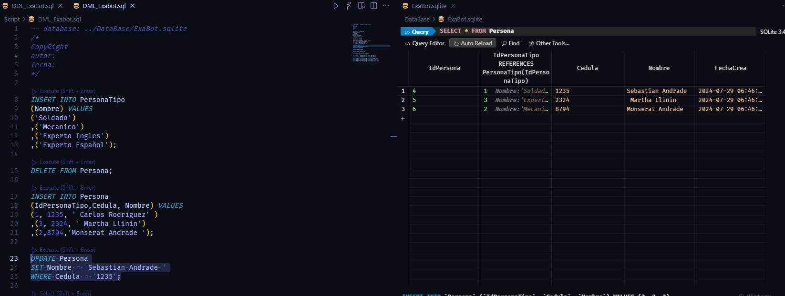
      </p>

8.  SELECT PersonaTipo.Nombre ,Persona.Nombre
    FROM PersonaTipo
    JOIN Persona on PersonaTipo.IdPersonaTipo = Persona.IdPersona; 

    -> En lo que nos ayuda es que se muestren dos columnas de dos tablas distintas
      EJEMPLO:
      <p align="center">
      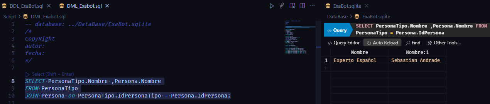
      </p>

9. SELECT pt.Nombre 'Cargo' ,p.Nombre 'Nombres'
   FROM PersonaTipo pt
   JOIN Persona p on pt.IdPersonaTipo = p.IdPersona;
   
    -> Este es la forma optimizada del anterior codigo y como pueden ver entre comillas podemos poner que nombre quieres q tenga la columna
       y tambien que puedes simplificar su nombre poniendo alado su simplificacion
      EJEMPLO:
      <p align="center">
      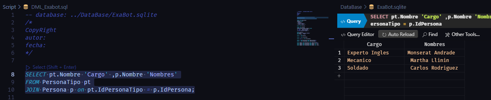
      </p>
## Clase nro 11

Diagrma MER:

<p align="center">
      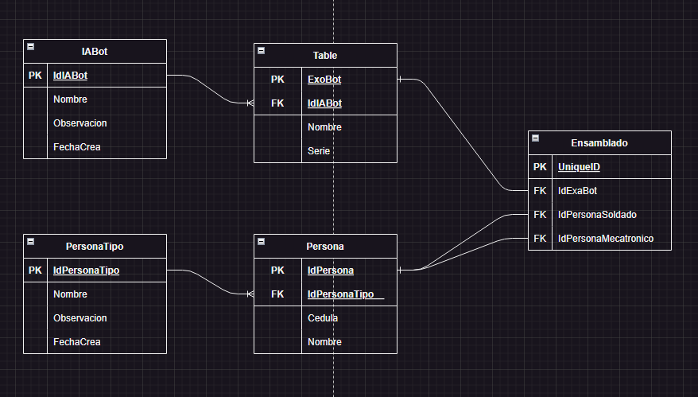
      </p>

### DataHelper
1.  Helper Objects en Java: En Java, los objetos auxiliares (helper objects) son clases que se 
    utilizan para realizar operaciones comunes que son compartidas por varias clases. Estos objetos 
    ayudan a mantener el código limpio y modular. Algunos ejemplos de uso de objetos auxiliares son:
    - Clases de utilidad (Utility Classes): Son clases con métodos estáticos que no tienen dependencias. 
      Por ejemplo, una clase llamada IOUtils podría contener métodos estáticos para cerrar flujos de 
      entrada/salida sin lanzar excepciones.
    - Clases de ayuda (Helper Classes): Estas clases tienen dependencias y, por lo tanto, pueden tener 
      métodos no estáticos. Por ejemplo, una clase llamada PriceHelper podría calcular precios para 
      diferentes productos o pedidos.

2.  DataHelper en el contexto de bases de datos: En el contexto de acceso a datos y bases de datos, el 
    término DataHelper puede referirse a un patrón de diseño que encapsula el manejo de la base de datos. 
    Estos objetos ayudan a acceder a los datos de manera más organizada y modular. Por ejemplo, un DataHelper 
    podría manejar la conexión a una base de datos y ejecutar consultas o transacciones.

### DAO 

1. El DAO es una clase o interfaz que encapsula la lógica de acceso a datos. Su objetivo principal es proporcionar 
una interfaz consistente y reutilizable para interactuar con la base de datos.

2. Un DAO generalmente ofrece operaciones CRUD para una entidad específica 
(por ejemplo, una tabla en la base de datos).

3. La implementación concreta del DAO se comunica con el DataHelper (como una conexión a la base de datos) 
para ejecutar consultas y transacciones.

### CRUD

CRUD es un acrónimo que se utiliza en programación y sistemas de bases de datos para describir las cuatro operaciones 
básicas de almacenamiento persistente:

1.  Crear (Create): Se refiere a la acción de agregar nuevos registros o entradas a una base de datos. 
    Por ejemplo, crear un nuevo usuario en una aplicación.
2.  Leer o Recuperar (Read o Retrieve): Implica obtener información existente de la base de datos. Por ejemplo, 
    leer los detalles de un producto o mostrar una lista de usuarios.
3.  Actualizar (Update): Significa modificar o cambiar los datos existentes en la base de datos. Por ejemplo, 
    actualizar la dirección de un cliente o cambiar el precio de un artículo.
4.  Borrar o Eliminar (Delete o Destroy): Se refiere a la acción de eliminar registros de la base de datos. 
    Por ejemplo, eliminar una publicación de un blog o dar de baja a un cliente.

### JDBC

JDBC (Java Database Connectivity) es una API (Interfaz de Programación de Aplicaciones) para el lenguaje de programación Java. 
Su objetivo es permitir que las aplicaciones Java se conecten a bases de datos y ejecuten consultas de manera independiente 
del sistema operativo o la base de datos específica. Aquí tienes algunos puntos clave sobre JDBC:

- Definición: JDBC proporciona métodos para consultar y actualizar datos en una base de datos, especialmente 
  orientada a bases de datos relacionales.
- Parte de Java SE: Forma parte de la plataforma Java Standard Edition (Java SE) de Oracle Corporation.
- Versiones: Ha evolucionado a lo largo del tiempo, con versiones como JDBC 3.0, JDBC 4.0, JDBC 4.1, JDBC 4.2 y la más reciente, JDBC 4.3.
- Funcionalidad: Permite crear conexiones a bases de datos, ejecutar declaraciones SQL (como SELECT, INSERT, UPDATE y 
  DELETE) y trabajar con procedimientos almacenados.
- Implementaciones múltiples: Dado que JDBC es principalmente una colección de definiciones de interfaces, permite que 
  múltiples implementaciones de estas interfaces - - coexistan y sean utilizadas por la misma aplicación en tiempo de ejecución.

### Libreria

Despues de buscar en la libreria los drives jdbclite3 descargamos el archivo y arrastramos a la libreria de nuestro proyecto

<p align="center">
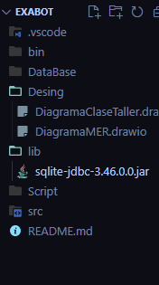
</p>

Puede suceder que al abrir el proyecto en otra maquina pierda la referencia de donde esta el jdbc asi que hacemos click derecho y
ponemos ubicacion del archivo y luego arrastramos hasta donde esta la parte de javaproyect en ReferenceLibraries

<p align="center">
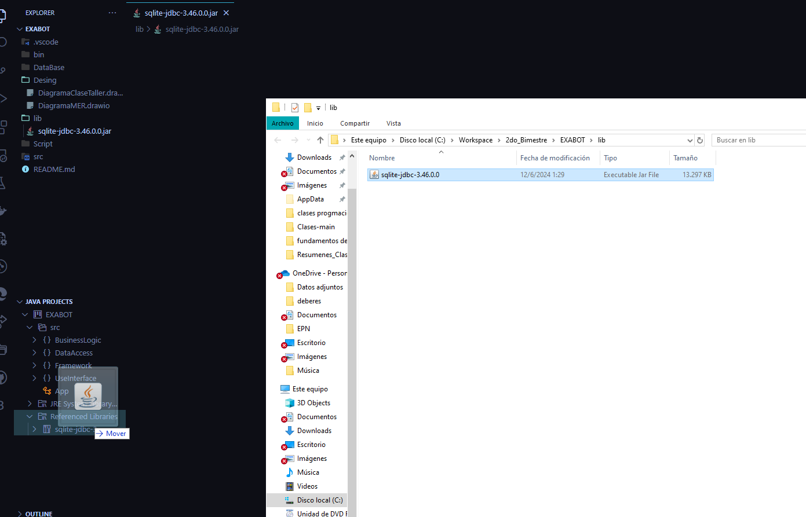
</p>

### DTO

Un DTO (Data Transfer Object) es un objeto utilizado para encapsular datos y enviarlos de un subsistema de una aplicación 
a otro. Aquí tienes algunos puntos clave sobre los DTOs:

- Propósito: Los DTOs se utilizan principalmente en la capa de Servicios de una aplicación N-Tier para transferir 
  datos entre sí y la capa de Interfaz de Usuario (UI).

- Beneficios:
    + Reducen la cantidad de datos que deben enviarse a través de la red en aplicaciones distribuidas.
    + Son útiles como modelos en el patrón MVC (Modelo-Vista-Controlador).
    + También pueden encapsular parámetros para llamadas a métodos.

- Assemblers: Al usar el patrón DTO, se suelen emplear ensambladores de DTOs. Estos convierten objetos del dominio en DTOs y viceversa.

### Proyecto

Como podemos ver en la imagen los demas van hacer package que vamos a crear en src:
<p align="center">
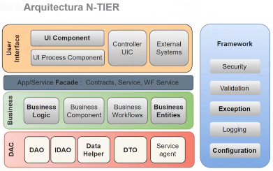
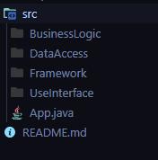
</p>

Esto es lo que vamos a copiar en la clase abstract SQLiteDataHelper

<p align="center">
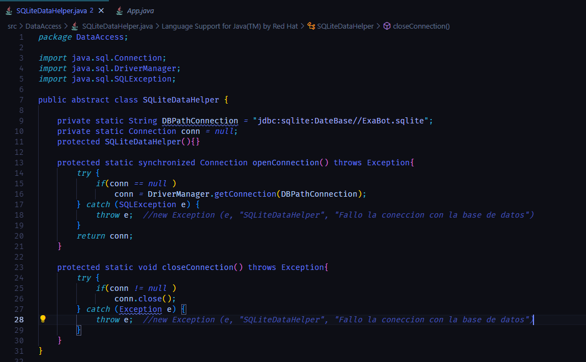
</p>

En la clase interface hay que copiar este codigo
<p align="center">
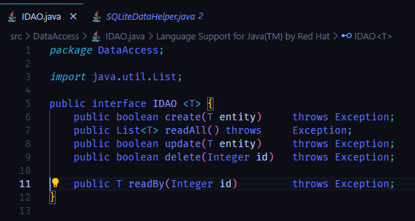
</p>

1. En el codigo podemos ver al lado de la case este simbolo <T> este se le llama generic y nos ayuda
   a que cuando en usemos los metodos en otras clase puedas ir cambiando ese nombre en los metodos y no tengas
   que perder tu tiempo cambiando en cada una de las clase persona, sexo, etc. En la siguiente imagen puedes ver 
   donde dice object y cambias el nombre que tu quieras y listo te ahorras tiempo.

<p align="center">

</p>

2. throws Exception; nos va ayudar por si ocurre un error 

En las clases DTO tenemos que poner los datos de las tablas que creamos de la base de datos

3. En nuestro package DTO creamos nuestra clase SexoDTO.java y copiamos los siguiente 

<p align="center">
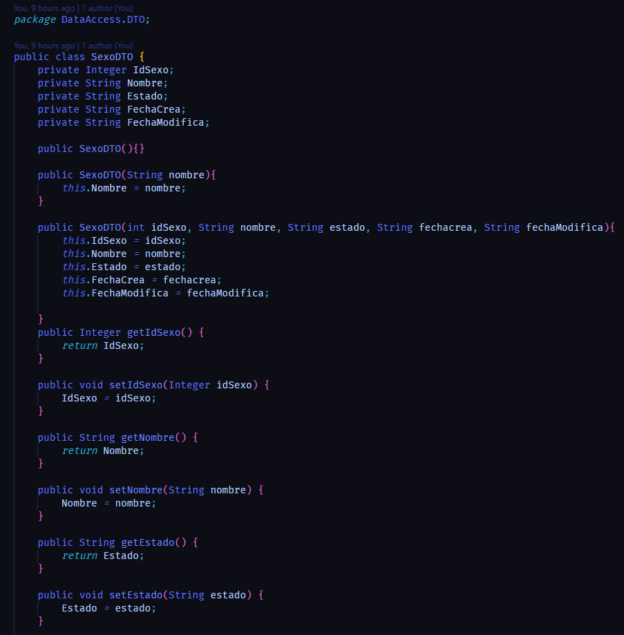
</p>

- Todo lo que encontramos es lo que esta en nuestra tabla Sexo de nuestra base de datos

4. Tambien vamos a escribir nuestra interface IDAO que va hacer el que tenga nuestros metodos que van a repartirse en las 
clases que vayamos creando que se van a conectar a nuestra base de datos

<p align="center">
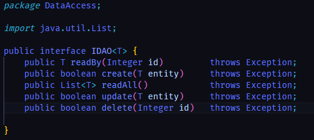
</p>
 
5. Por ultimo nuestra clase sexo:


<p align="center">
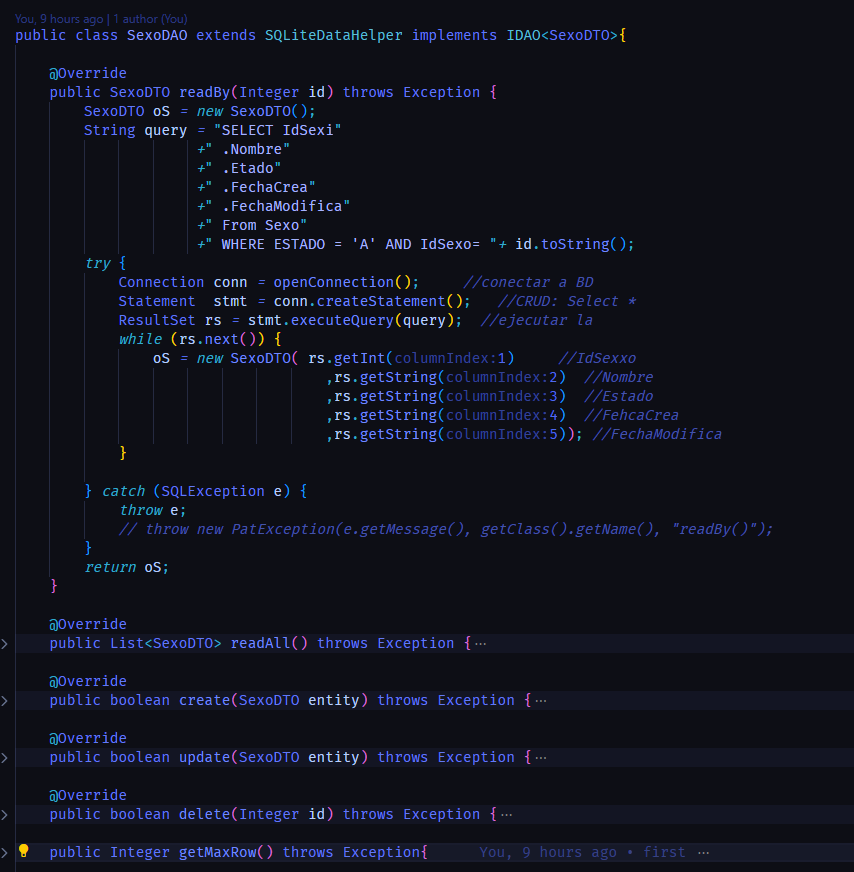
</p>

## Clase nro 12

### DAC + DataBase

En esta clase empezamos por crear un catalogo en nuetro MER 

<p align="center">
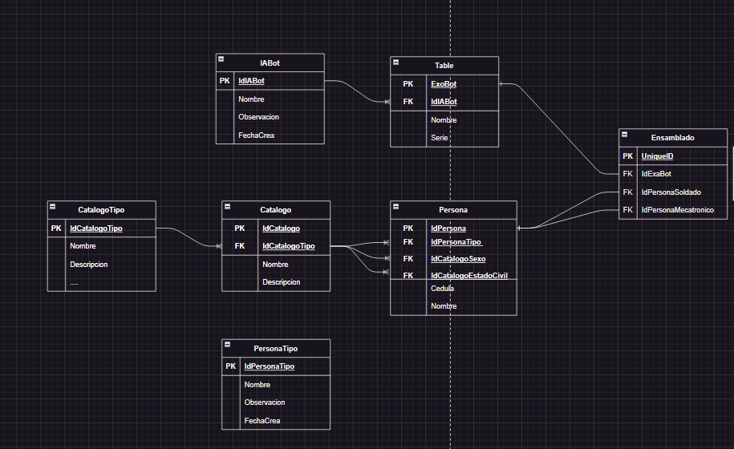
</p>

y asi se veria en nuestro DDL, tambien modificamos la clase persona:

<p align="center">
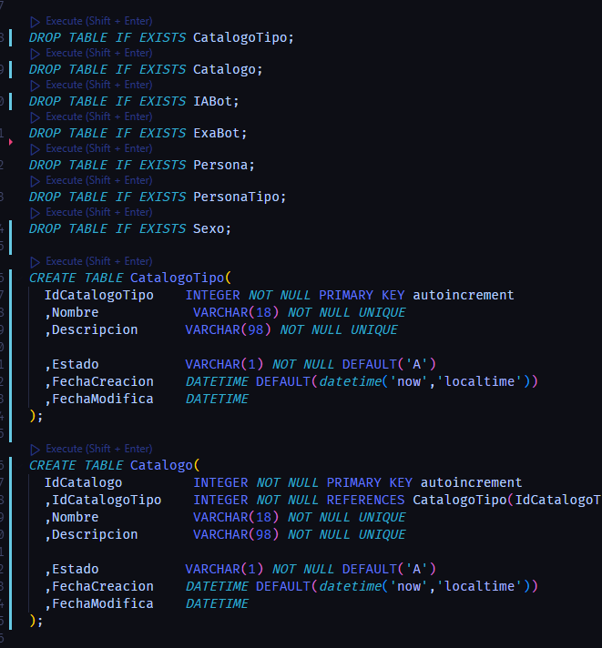 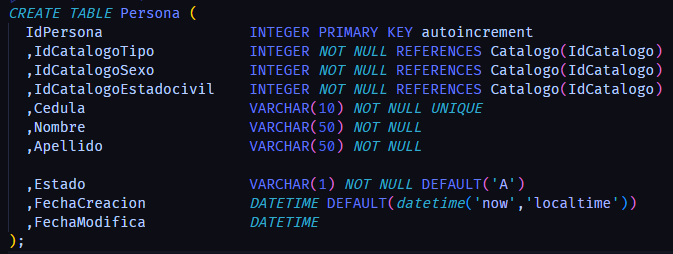 
</p>

Esta es la informacion que vamos a meter en nuestras tablas:

<p align="center">
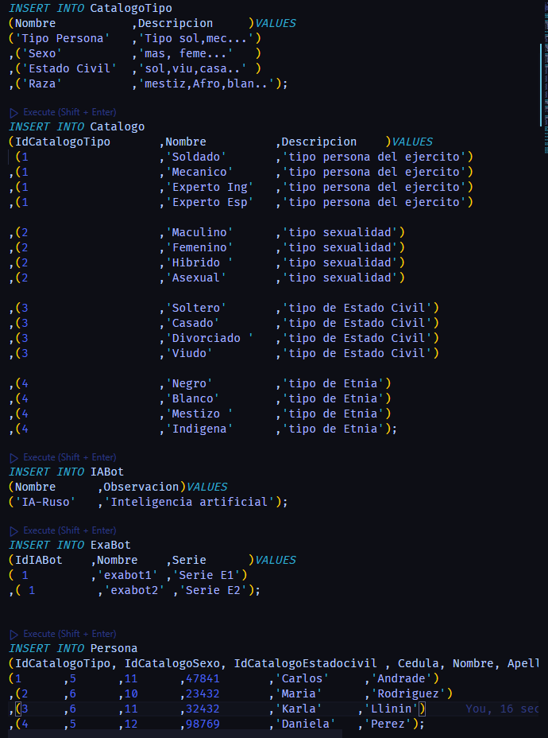
</p>

- A continuacion vamos a crear otra clase llamada SexoDAO y la que ya estaba con ese nombre la vamos a cambiar por 
  SexoAntDAO:
- Como vimos en esta clase lo de catalogo estas clases nueva de Sexo van a tener diferentes propiedades que la anterior
  clase sexo y lo que intentamos ver aqui es que el codigo que usamos en la anterior va a ser identico solo que con unos 
  cambios en la clase SexoDAO y en la clase SexoAntDAO.A continuacion van a ver el codigo final de las nuevas clases:

1. Clase SexoDTO 

<p align="center">
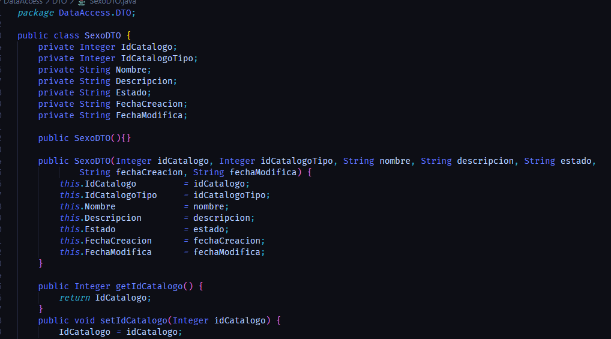
</p>

2. Clase SexoDAO

<p align="center">
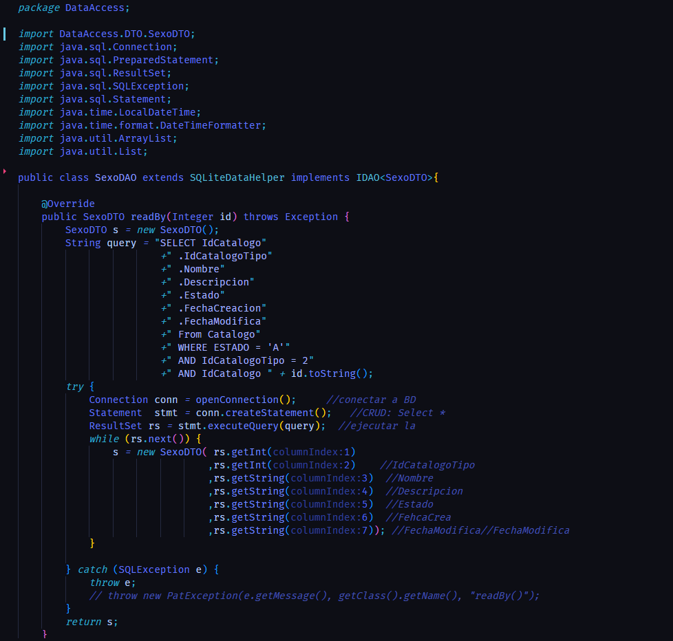
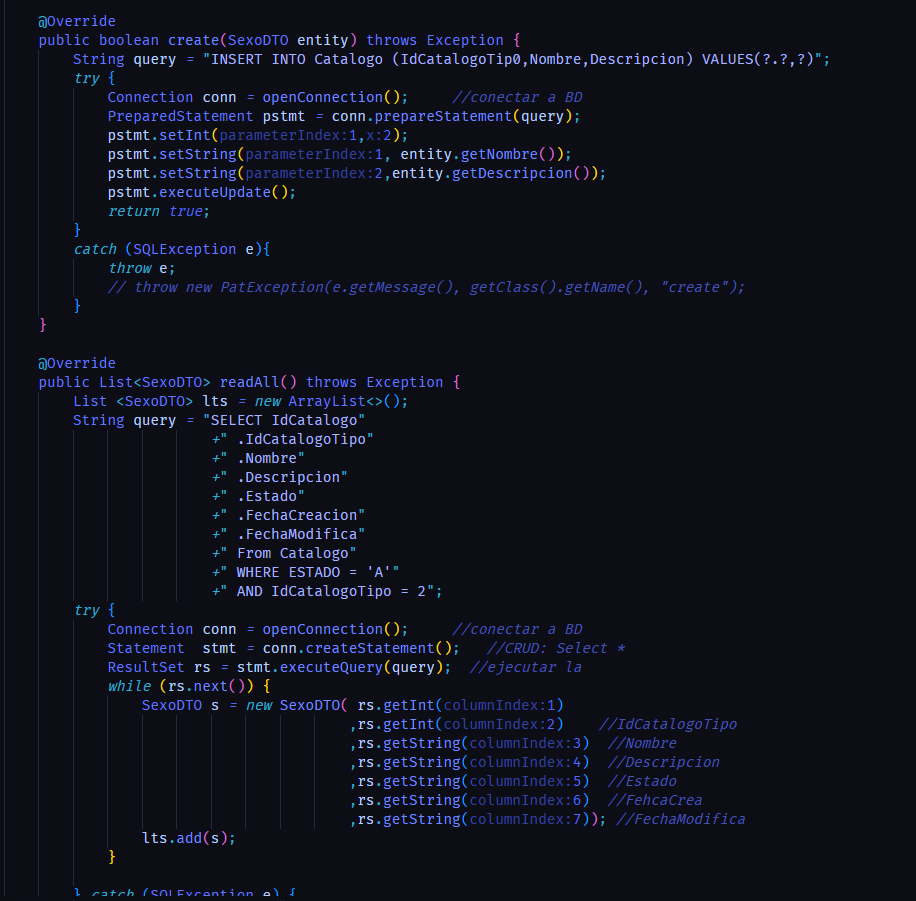
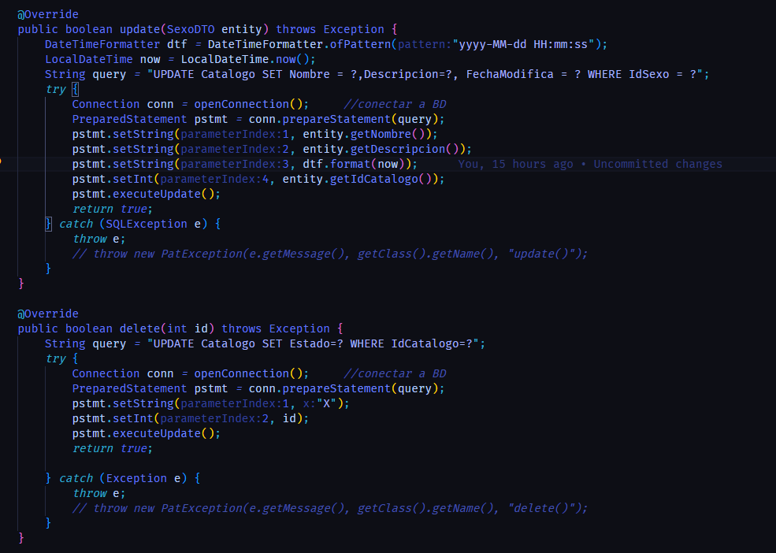
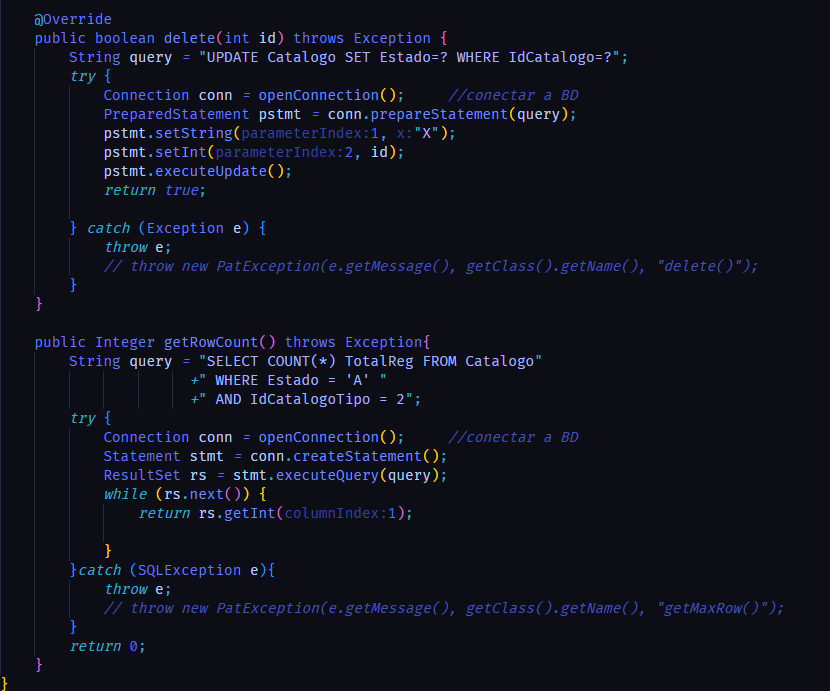
</p>

3. Mandamos a imprimir para ver si nuestro proyecto esta conectada a la libreria jdbc 

<p align="center">
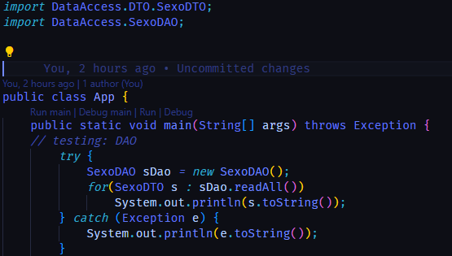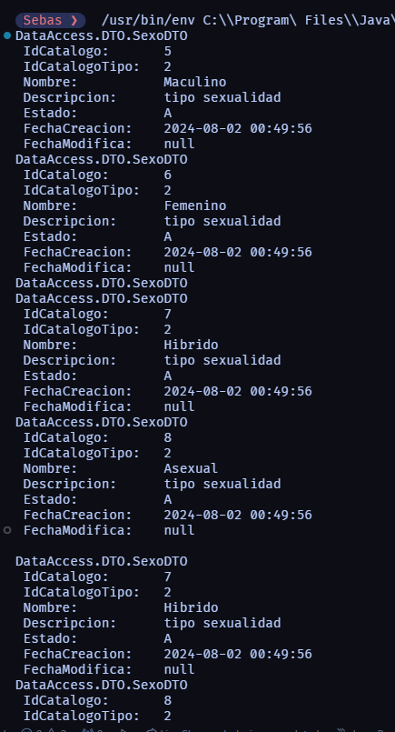
</p>
- Una conclusion es que todas las clases que creemos en el package de DataAcces es repetitiva, lo unico que cambia cosas minimas del 
  codigo y despues lo que vamos hacer es lo mismo para las demas clases.

## Clase nro 13

### BL

Ahora que ya acabamos con el DAC, continuamos con la siguiente etapa que es BL

<p align="center">
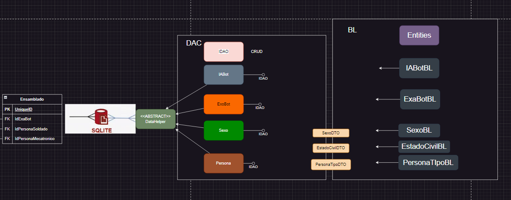
</p>

Y en nuestro package BusinessLogic vamos  a crear otro package llamado Entities y ahi vamos a crear nuestra clase SexoBL. Vamos a copiar el
siguiente codigo en esa clase:

<p align="center">
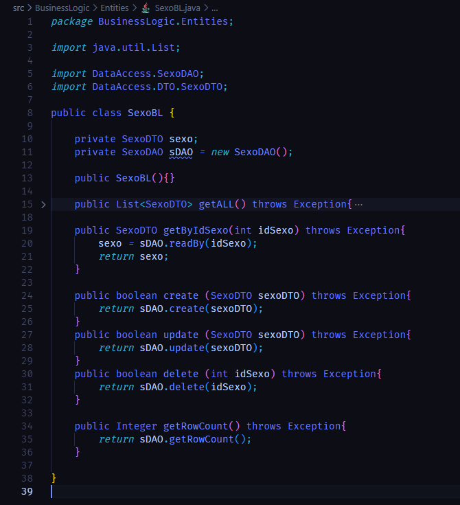
</p>

Despues vamos a testear que todo este correcto y que no haya errores

<p align="center">
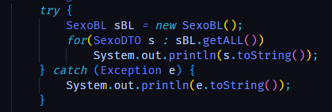 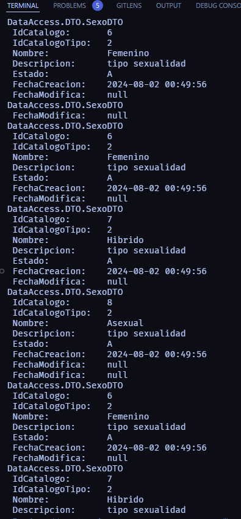
</p>

## Clase nro 14

### GUI


